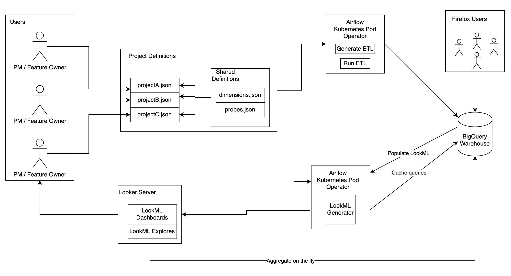
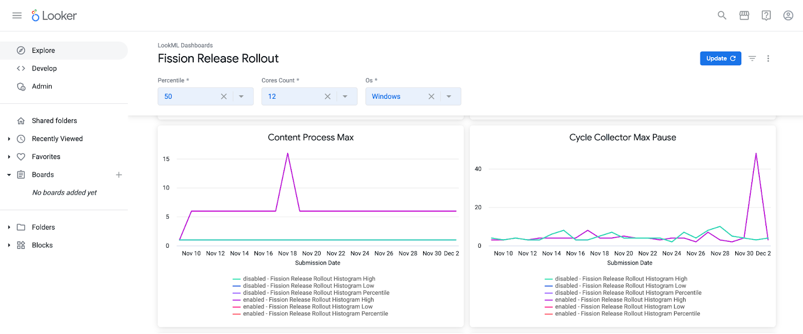

Operational Monitoring
===

This document will focus on the implementation of Operational Monitoring. To understand how to use Operational Monitoring, see the [documentation at dtmo](https://docs.telemetry.mozilla.org/cookbooks/operational_monitoring.html).

## Overview

The diagram above shows the relationship between different parts of the Operational Monitoring system. At a high level, data flows through the system in the following way:

1. Users create project definition files as described on [dtmo](https://docs.telemetry.mozilla.org/cookbooks/operational_monitoring.html)
2. Two daily jobs run in Airflow to process the config files: one to generate + run the ETL and one to generate LookML for views/explores/dashboards
3. Updated LookML dashboards and explores are available once per day and loading them runs aggregates on the fly by referencing relevant BigQuery tables.

Below we will dive deeper into what's happening under the hood.

## ETL Generator

The ETL generator takes the project definition files as input and uses [Jinja](https://jinja.palletsprojects.com/en/3.0.x/) templates to generate different SQL queries to process the relevant data. At a high level, it works by doing the following steps for each project file:

1) Check if the project file was updated since the last time its SQL queries were generated - if so, regenerate.
2) For each data source in the `analysis` list in the project definition:

    a. For each data type (e.g. scalars, histograms), generate a different query

The aggregations done in this ETL are at the client-level. The queries are grouped by the branch, x-axis value (build id or submission date), and dimensions listed in the project config.
Normalization is done so that clients with many submissions would only count once.
* For histograms, this is done by summing up values for each bucket then dividing each bucket by the total number of submissions. For more detail, see [`histogram_normalized_sum()`](https://github.com/mozilla/bigquery-etl/blob/main/sql/mozfun/glam/histogram_normalized_sum/udf.sql)
* For scalars, this is done by computing an aggregate function for each client (e.g. sum, avg, etc)

Although the ETL uses a single set of SQL templates, in order to support both build IDs and submission dates on the x-axis, the data is stored/represented in slightly different ways for each case.
* For build IDs on the x-axis, submission date is used as the partition but previous submission dates are only there for backup. The most recent submission date is the only one of interest as it will include all relevant builds to be graphed.
* For submission dates on the x-axis, submission date is also used as the partition, but they are not backups. The previous submission dates will include dates that need to be graphed.

## ETL Runner

The [Operational Monitoring DAG](https://workflow.telemetry.mozilla.org/tree?dag_id=operational_monitoring) runs once per day in Airflow.

A separate table is generated for each operational monitoring project + data type. For example, a given project will have 1 table for scalars that might consist of scalars pulled in from a variety of different tables in BigQuery.

## LookML Generator

Specific LookML is generated for Operational Monitoring. The code for this lives in the [lookml-generator](https://github.com/mozilla/lookml-generator) repo and runs daily as part of the [probe_scraper DAG](https://workflow.telemetry.mozilla.org/tree?dag_id=probe_scraper). Each run performs the following steps:

1) A view is generated for each table that is outputted from the ETL runner. The view contains the dimensions (e.g. metric, branch, build_id) and a measure that computes percentiles
2) Explores are generated for each view, these include Looker [aggregate tables](https://docs.looker.com/reference/explore-params/aggregate_table) for each graph shown in the default view of a dashboard
3) Dashboards are generated for each project

## Output

Below is an example of a dashboard generated by Operational Monitoring for the [Fission Release Rollout](https://mozilla.cloud.looker.com/dashboards/operational_monitoring::fission_release_rollout?Percentile=50&Cores%20Count=2&Os=Windows)

Note that the dropdowns shown, aside from `Percentile` are generated based on the project definition. There is one dropdown for each dimension specified and it is populated by querying unique values for that dimension. The default value for each dropdown is the most common value found in the table.