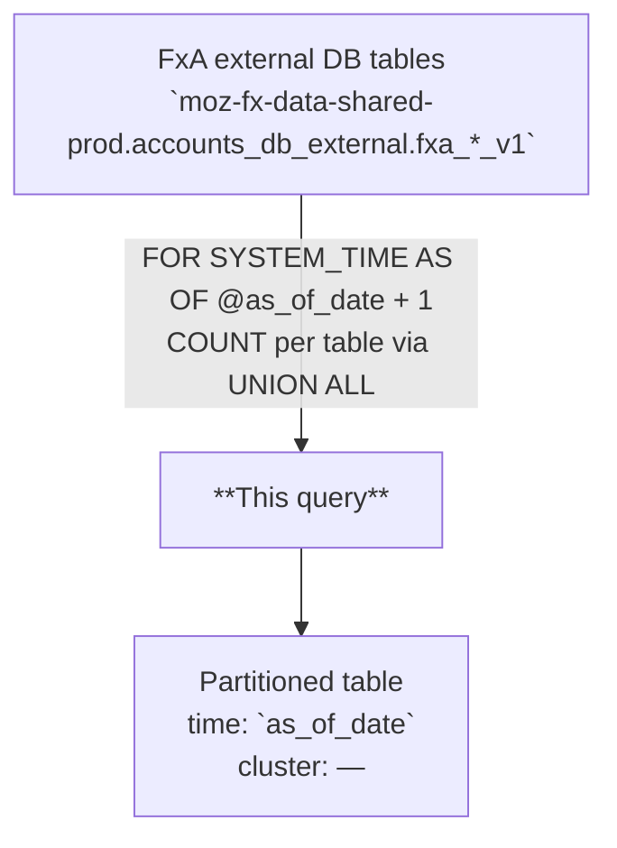

# FxA DB Counts Monitoring

Daily snapshot of row counts across Firefox Accounts (FxA) database tables, at the grain of one row per `(as_of_date, table_name)`, sourced from BigQuery-replicated FxA external tables using point-in-time reads.

---

## 📌 Overview

| | |
|---|---|
| **Grain** | One row per `(as_of_date, table_name)` |
| **Source** | `moz-fx-data-shared-prod.accounts_db_external.fxa_*_v1` (27 tables) |
| **DAG** | `bqetl_accounts_derived` · daily · incremental |
| **Partitioning** | `as_of_date` *(no partition filter required)* |
| **Clustering** | — |
| **Retention** | No automatic expiration |
| **Owner** | wclouser@mozilla.com |
| **Version** | v1 (initial version) |

**Use cases:** DB health monitoring · trend analysis across FxA entity tables · detecting anomalous growth or loss in account-related data

---

## 🗺️ Data Flow



---

## 🧠 How It Works

1. **Input** — 27 FxA external tables in `accounts_db_external` each represent one database entity (accounts, devices, tokens, etc.), read at a point-in-time snapshot using `FOR SYSTEM_TIME AS OF TIMESTAMP(@as_of_date + 1, 'UTC')`.
2. **Aggregation** — each branch of a `UNION ALL` emits `(table_name, COUNT(*))` or `COUNT(DISTINCT uid)` for the relevant table; the outer `SELECT` prepends `@as_of_date` as the partition column.
3. **Derived metrics** — three virtual "tables" are computed via JOIN: `accounts_with_secondary_emails`, `accounts_with_unverified_emails`, and counts of accounts linked to Google (`providerId = 1`) or Apple (`providerId = 2`).
4. **Point-in-time fidelity** — all source reads use the same `@as_of_date + 1` timestamp, ensuring counts reflect database state at end-of-day for `as_of_date`.
5. **Data inclusion** — all records from each source table are included; no bot, synthetic, or test-account exclusions are applied at this layer.

---

## 🧾 Key Fields

### Dimensions

| Category | Fields |
|---|---|
| Date | `as_of_date` |
| Table identity | `table_name` |

### Metrics

| Category | Fields |
|---|---|
| Row counts | `total_rows` |

---

## 🧩 Example Queries

```sql
-- 1. Latest counts for all FxA tables
SELECT
  table_name,
  total_rows
FROM `moz-fx-data-shared-prod.accounts_backend_derived.monitoring_db_counts_v1`
WHERE as_of_date = DATE_SUB(CURRENT_DATE(), INTERVAL 1 DAY)
ORDER BY total_rows DESC;
```

```sql
-- 2. 30-day trend for a specific table
SELECT
  as_of_date,
  total_rows
FROM `moz-fx-data-shared-prod.accounts_backend_derived.monitoring_db_counts_v1`
WHERE as_of_date >= DATE_SUB(CURRENT_DATE(), INTERVAL 30 DAY)
  AND table_name = 'accounts'
ORDER BY 1;
```

```sql
-- 3. Day-over-day growth rate per table (last 7 days)
SELECT
  curr.as_of_date,
  curr.table_name,
  curr.total_rows,
  SAFE_DIVIDE(curr.total_rows - prev.total_rows, prev.total_rows) AS daily_growth_rate
FROM `moz-fx-data-shared-prod.accounts_backend_derived.monitoring_db_counts_v1` AS curr
LEFT JOIN `moz-fx-data-shared-prod.accounts_backend_derived.monitoring_db_counts_v1` AS prev
  ON curr.table_name = prev.table_name
  AND prev.as_of_date = DATE_SUB(curr.as_of_date, INTERVAL 1 DAY)
WHERE curr.as_of_date >= DATE_SUB(CURRENT_DATE(), INTERVAL 7 DAY)
ORDER BY 1 DESC, daily_growth_rate DESC;
```

---

## 🔧 Implementation Notes

- Incremental: one partition written per run, filtered by `@as_of_date`; each run covers a single date.
- All 27 source tables are read at `TIMESTAMP(@as_of_date + 1, 'UTC')` — midnight-UTC boundary of the snapshot date — ensuring consistent point-in-time counts.
- Three derived rows (`accounts_with_secondary_emails`, `accounts_with_unverified_emails`, `accounts_linked_to_google`, `accounts_linked_to_apple`) use `COUNT(DISTINCT uid)` via JOIN rather than simple `COUNT(*)`.
- Provider IDs for linked accounts follow `LinkedAccountProviderIds` in the FxA codebase: `1 = Google`, `2 = Apple`.
- `SAFE_DIVIDE` is recommended for any downstream growth-rate or ratio calculations to avoid division-by-zero on empty tables.

---

## 📌 Notes & Conventions

- `total_rows` = `COUNT(*)` for standard tables; `COUNT(DISTINCT uid)` for derived account-level metrics (`accounts_with_secondary_emails`, `accounts_with_unverified_emails`, `accounts_linked_to_google`, `accounts_linked_to_apple`).
- `table_name` values are hardcoded string labels matching the FxA source table names (e.g., `'accounts'`, `'devices'`) plus the four computed labels above.
- `as_of_date` is the partition column; each date's row reflects FxA DB state as of the end of that day (midnight UTC the following day).

---

## 🗃️ Schema & Related Tables

- Full field definitions: [`schema.yaml`](schema.yaml)
- **Upstream**: `moz-fx-data-shared-prod.accounts_db_external.fxa_*_v1` — BigQuery-replicated snapshots of Firefox Accounts MySQL database tables
- **Downstream**: used by FxA monitoring dashboards and data quality checks to track entity counts and detect anomalous trends
