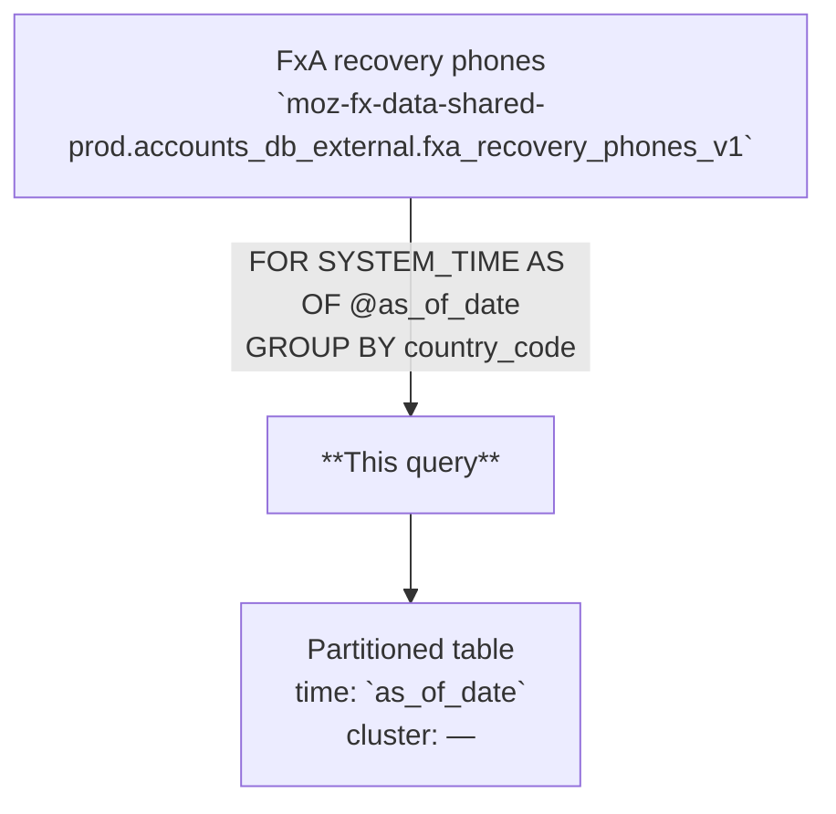

# FxA DB Counts Monitoring: Recovery Phones Segmentation

Daily count of Firefox Accounts recovery phone records, broken down by country. Each row represents the total number of recovery phones registered in a given country as of the snapshot date, derived from a time-travel read of the external accounts database table.

---

## 📌 Overview

| | |
|---|---|
| **Grain** | One row per `(as_of_date, country_code)` |
| **Source** | `moz-fx-data-shared-prod.accounts_db_external.fxa_recovery_phones_v1` |
| **DAG** | `bqetl_accounts_derived` · daily · incremental |
| **Partitioning** | `as_of_date` |
| **Clustering** | — |
| **Retention** | No automatic expiration |
| **Owner** | wclouser@mozilla.com |
| **Version** | v1 (initial version) |

**Use cases:** monitor recovery phone adoption by country · track day-over-day changes in recovery phone registrations · support database health and size monitoring

---

## 🗺️ Data Flow



---

## 🧠 How It Works

1. **Input** — `fxa_recovery_phones_v1` has one row per registered recovery phone; the query reads a historical snapshot using `FOR SYSTEM_TIME AS OF TIMESTAMP(@as_of_date + 1, 'UTC')`.
2. **Country extraction** — `country_code` is parsed from the `lookupData` JSON column using `SAFE.JSON_VALUE(lookupData, '$.countryCode')`.
3. **Aggregation** — rows are grouped by `country_code` and `COUNT(uid)` produces the total number of recovery phone records per country.
4. **Partitioning** — `@as_of_date` is written directly into the `as_of_date` column and used as the day partition key.
5. **Data inclusion** — all recovery phone records present in the snapshot are included; no bot, synthetic, or test-account exclusions are applied at this layer.

---

## 🧾 Key Fields

### Dimensions

| Category | Fields |
|---|---|
| Date & Geo | `as_of_date`, `country_code` |

### Metrics

| Category | Fields |
|---|---|
| Recovery Phones | `total_rows` |

---

## 🧩 Example Queries

```sql
-- 1. Total recovery phone records for the last 7 days
SELECT
  as_of_date,
  SUM(total_rows) AS total_recovery_phones
FROM `moz-fx-data-shared-prod.accounts_backend_derived.monitoring_db_recovery_phones_counts_v1`
WHERE as_of_date >= DATE_SUB(CURRENT_DATE(), INTERVAL 7 DAY)
GROUP BY 1
ORDER BY 1 DESC;
```

```sql
-- 2. Top countries by recovery phone count on the most recent day
SELECT
  as_of_date,
  country_code,
  total_rows,
  SAFE_DIVIDE(total_rows, SUM(total_rows) OVER (PARTITION BY as_of_date)) AS share_of_total
FROM `moz-fx-data-shared-prod.accounts_backend_derived.monitoring_db_recovery_phones_counts_v1`
WHERE as_of_date = DATE_SUB(CURRENT_DATE(), INTERVAL 1 DAY)
ORDER BY total_rows DESC
LIMIT 20;
```

```sql
-- 3. Week-over-week change in recovery phone counts for a specific country
SELECT
  as_of_date,
  country_code,
  total_rows,
  LAG(total_rows, 7) OVER (PARTITION BY country_code ORDER BY as_of_date) AS total_rows_7d_ago,
  SAFE_DIVIDE(total_rows - LAG(total_rows, 7) OVER (PARTITION BY country_code ORDER BY as_of_date),
              LAG(total_rows, 7) OVER (PARTITION BY country_code ORDER BY as_of_date)) AS wow_change
FROM `moz-fx-data-shared-prod.accounts_backend_derived.monitoring_db_recovery_phones_counts_v1`
WHERE as_of_date >= DATE_SUB(CURRENT_DATE(), INTERVAL 14 DAY)
  AND country_code = 'US'
ORDER BY 1 DESC;
```

---

## 🔧 Implementation Notes

- Incremental: filtered by `@as_of_date` parameter; one partition written per run using `date_partition_parameter`.
- The time-travel query uses `FOR SYSTEM_TIME AS OF TIMESTAMP(@as_of_date + 1, 'UTC')` to read the state of the external table at the end of the partition date.
- `country_code` is extracted via `SAFE.JSON_VALUE` — returns NULL if `lookupData` is NULL or the `countryCode` key is absent; unknown countries are typically stored as `??`.
- No deduplication applied — source rows represent distinct recovery phone registrations.
- `SAFE_DIVIDE` is recommended for any ratio calculations downstream to avoid division-by-zero.

---

## 📌 Notes & Conventions

- `total_rows` = `COUNT(uid)` — total recovery phone records for the country on the snapshot date; does not deduplicate across users (a user can have at most one recovery phone, so this approximates unique registered users with a recovery phone in that country).
- `country_code` — ISO 3166-1 alpha-2 code derived from IP geolocation stored in `lookupData`; `??` indicates unknown country.
- `as_of_date` — the snapshot date, not the registration date; reflects the state of the database as of midnight UTC on that day.

---

## 🗃️ Schema & Related Tables

- Full field definitions: [`schema.yaml`](schema.yaml)
- **Upstream**: `moz-fx-data-shared-prod.accounts_db_external.fxa_recovery_phones_v1` — external table containing raw recovery phone registration records from the FxA accounts database
- **Downstream**: no known public views; used for accounts database health monitoring
