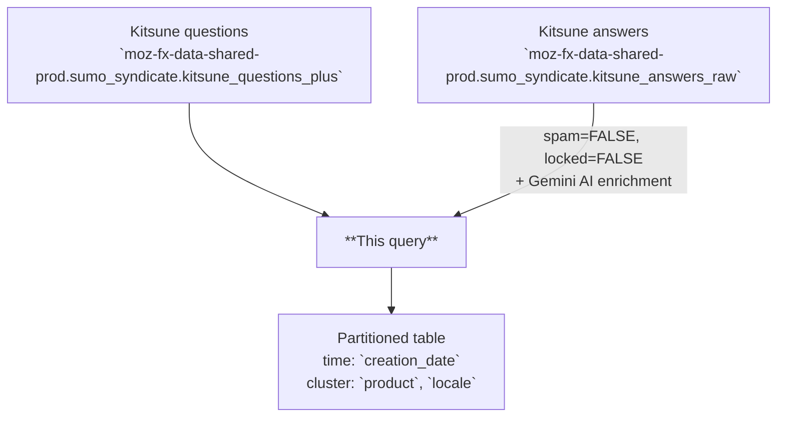

# Kitsune Retrieval Index

AI-enriched retrieval table derived from Kitsune (SUMO), one row per question–answer pair per creation date. Combines original question and answer fields with Gemini-generated summaries, classifications, sentiment scores, and vector embeddings to support semantic search and grounded question answering over Mozilla Support data.

---

## 📌 Overview

| | |
|---|---|
| **Grain** | One row per `(creation_date, question_id, answer_id)` |
| **Source** | `moz-fx-data-shared-prod.sumo_syndicate.kitsune_questions_plus`, `moz-fx-data-shared-prod.sumo_syndicate.kitsune_answers_raw` |
| **DAG** | `bqetl_analytics_tables` · daily · incremental |
| **Partitioning** | `creation_date` *(partition filter required)* |
| **Clustering** | `product`, `locale` |
| **Retention** | No automatic expiration |
| **Owner** | lvargas@mozilla.com |
| **Version** | v1 (initial version) |

**Use cases:** support question analysis · semantic search via embeddings · sentiment trend monitoring

---

## ⚠️ Analysis Caveats

> Read this section before writing queries. These are the most common sources of incorrect results.

- **`creation_date` filter is required.** The table enforces a partition filter — omitting it will error or cause a full table scan.
- **`metadata.embedding_succeeded` is the *only* reprocessing driver.** Today this equals `embedding IS NOT NULL`. The reprocess job runs `WHERE NOT metadata.embedding_succeeded`. LLM-field issues do **not** trigger reruns — they are visible via `failure_reasons` for triage but never gate reprocessing.
- **Filter on individual LLM columns when you need clean values.** `question_summary_llm`, `question_category_llm`, `question_language_llm`, `question_entities_llm`, `question_topics_llm`, and `question_sentiment_score` can each be NULL or empty independently. If you're aggregating or grouping by one of them, filter `WHERE <col> IS NOT NULL` (and for arrays, `ARRAY_LENGTH(<col>) > 0`).
- **`question_sentiment_score` is NULL'd at write time when the model returns out-of-range values.** A NULL sentiment is either "model returned nothing" or "model returned >1 / <-1 and we discarded it." `metadata.failure_reasons` distinguishes the two: tags `question_sentiment_score_missing` vs `question_sentiment_score_out_of_range`.
- **`metadata.failure_reasons` lists every quality check that fired.** Tags include `embedding_missing`, `question_summary_llm_missing`, `question_category_llm_missing`, `question_language_llm_missing`, `question_sentiment_score_missing`, `question_sentiment_score_out_of_range`, `question_entities_llm_missing`, `question_entities_llm_has_empty_elements`, `question_topics_llm_missing`, `question_topics_llm_has_empty_elements`. Empty array when all checks pass. Use for model/prompt regression triage; **never** as a reprocessing condition.
- **For embedding/retrieval, filter on `embedding IS NOT NULL` (equivalent to `metadata.embedding_succeeded`) at minimum.** This is what the consumer-facing view enforces.
- **`answer_content` is not embedded.** Vector similarity reflects question text (`title` + `content`) only — high similarity means similar *questions*, not better *answers*.
- **Always embed query text with `gemini-embedding-001`.** Mixing embedding models produces mathematically meaningless distances.
- **Partitions are open: late-arriving answers are picked up on rerun.** A partition is keyed on the *question's* `creation_date`, but answers can arrive any time after — even a year later — and are joined onto the partition's questions when the partition runs. Re-running an old partition (backfill) will therefore include any answers that have arrived since the last run. Question-level row counts and AI fields stay deterministic for a given source snapshot; answer-level columns (`answer_id`, `answer_content`, `num_helpful_votes`, `num_unhelpful_votes`, `is_self_answer`) reflect whatever state existed at run time. Treat the partition as the join of "questions on this date" × "all of their answers as of the last run".
- **Vote counts reflect the last run, not today.** `num_helpful_votes` and `num_unhelpful_votes` are captured at the moment the partition was last written. Re-run the partition to refresh them.
- **Unanswered questions are included.** `answer_id` and `answer_content` are NULL for questions with no answer (LEFT JOIN). Filter on `answer_id IS NOT NULL` if you only want answered questions.

---

## 🗺️ Data Flow



---

## 🧠 How It Works

1. **Input** — `kitsune_questions_plus` provides one row per support question; `kitsune_answers_raw` provides answers joined by `question_id`.
2. **AI generation** — `AI.GENERATE` with Gemini produces summary, category, language, entities, topics, and sentiment score per question.
3. **Embedding** — `AI.EMBED` with `gemini-embedding-001` generates a dense vector from concatenated `title` and `content`.
4. **Scoring and metadata** — A metadata struct captures model versions, quality scores, and a validation status flag. The recency score is computed at read time by the `customer_experience.kitsune_retrieval_index` view (not stored in this table).
5. **Data inclusion** — Only non-spam, non-locked questions and answers are included; no additional bot or synthetic exclusions are applied.

---

## 🧾 Key Fields

### Dimensions

| Category | Fields |
|---|---|
| Date | `creation_date` |
| Product & Topic | `product`, `locale`, `topic`, `tier{1\|2\|3}_topic` |
| Content | `title`, `content`, `answer_content`, `type` |
| Flags | `is_self_answer` |
| Timing | `answer_latency_seconds` |
| AI-generated | `question_summary_llm`, `question_category_llm`, `question_language_llm`, `question_entities_llm`, `question_topics_llm` |

### Metrics

| Category | Fields |
|---|---|
| Votes | `num_helpful_votes`, `num_unhelpful_votes` |
| Scores | `question_sentiment_score` (this table) · `recency_score` (view only) |
| Embedding | `embedding` |

---

## 🔍 Working with Embeddings

The `embedding` column is a dense float array produced by `AI.EMBED(CONCAT(title, ' ', content), endpoint => 'gemini-embedding-001')`. Use it to find questions similar to a free-text query, cluster support topics, or power grounded QA retrieval.

> **Prerequisites:** running `AI.EMBED` on your own query text requires Vertex AI access and incurs BigQuery ML costs. Contact your data platform team if you hit permission errors.

**Semantic search with `VECTOR_SEARCH`:**

```sql
-- Find the 10 most semantically similar Firefox Desktop questions to a free-text query.
-- Notes:
--  • The partition filter (`creation_date >=`) MUST live inside the base subquery — the
--    underlying table requires a partition filter, and VECTOR_SEARCH scans `base` before
--    any outer WHERE is applied.
--  • The query embedding is passed as a one-row table (subquery aliased to `embedding`)
--    paired with `query_column_to_search => 'embedding'`. This is the documented form for
--    subquery-shaped query inputs and avoids relying on scalar-to-array coercion.
SELECT
  base.question_id,
  base.title,
  base.question_summary_llm,
  base.product,
  distance
FROM
  VECTOR_SEARCH(
    (
      SELECT *
      FROM `moz-fx-data-shared-prod.customer_experience.kitsune_retrieval_index`
      WHERE creation_date >= DATE_SUB(CURRENT_DATE(), INTERVAL 30 DAY)
        AND product = 'Firefox Desktop'
    ),
    'embedding',
    (
      SELECT
        AI.EMBED(
          'Firefox password manager not saving logins',
          endpoint => 'gemini-embedding-001'
        ).result AS embedding
    ),
    query_column_to_search => 'embedding',
    top_k => 10,
    distance_type => 'COSINE'
  )
ORDER BY distance ASC;
```

**Distance interpretation (cosine distance, lower = more similar):**

| Range | Meaning |
|---|---|
| < 0.3 | Strong match |
| 0.3 – 0.6 | Related |
| > 0.6 | Loosely related |

---

## 🧩 Example Queries

```sql
-- 1. Daily question volume and average sentiment by product
--    (question_sentiment_score is already NULL for missing/out-of-range rows, so AVG ignores them)
SELECT
  creation_date,
  product,
  COUNT(*) AS question_count,
  AVG(question_sentiment_score) AS avg_sentiment
FROM `moz-fx-data-shared-prod.customer_experience.kitsune_retrieval_index`
WHERE creation_date >= DATE_SUB(CURRENT_DATE(), INTERVAL 7 DAY)
GROUP BY 1, 2
ORDER BY 1 DESC;
```

```sql
-- 2. Top AI-generated categories by locale with helpful vote ratio
SELECT
  locale,
  question_category_llm,
  COUNT(*) AS question_count,
  SAFE_DIVIDE(SUM(num_helpful_votes), SUM(num_helpful_votes + num_unhelpful_votes)) AS helpful_rate
FROM `moz-fx-data-shared-prod.customer_experience.kitsune_retrieval_index`
WHERE creation_date >= DATE_SUB(CURRENT_DATE(), INTERVAL 30 DAY)
  AND question_category_llm IS NOT NULL
GROUP BY 1, 2
ORDER BY question_count DESC;
```

```sql
-- 3. Negative sentiment questions for a specific product
SELECT
  creation_date,
  title,
  question_summary_llm,
  question_sentiment_score
FROM `moz-fx-data-shared-prod.customer_experience.kitsune_retrieval_index`
WHERE creation_date >= DATE_SUB(CURRENT_DATE(), INTERVAL 7 DAY)
  AND product = 'Firefox Desktop'
  AND question_sentiment_score < -0.5
ORDER BY question_sentiment_score ASC
LIMIT 50;
```

```sql
-- 4. Triage: which checks are firing most often?
SELECT
  reason,
  COUNT(*) AS row_count
FROM `moz-fx-data-shared-prod.customer_experience_derived.kitsune_retrieval_index_v1`,
  UNNEST(metadata.failure_reasons) AS reason
WHERE creation_date >= DATE_SUB(CURRENT_DATE(), INTERVAL 7 DAY)
GROUP BY 1
ORDER BY row_count DESC;
```

```sql
-- 5. Operations: rows that need reprocessing (embedding failure only)
SELECT creation_date, question_id
FROM `moz-fx-data-shared-prod.customer_experience_derived.kitsune_retrieval_index_v1`
WHERE creation_date BETWEEN '2026-04-01' AND '2026-04-30'
  AND NOT metadata.embedding_succeeded;
```

---

## 🔧 Implementation Notes

- Incremental: filtered by a configurable start date; one partition written per run.
- Both sources are read from the shared-prod syndicate: `kitsune_questions_plus` and `kitsune_answers_raw`.
- **Question CTE** filters `kitsune_questions_plus` to `DATE(created_date) = @submission_date`.
- **Answer CTE** filters `kitsune_answers_raw` to `DATE(created_date) >= @submission_date AND question_id IN (questions for this partition)` — so every answer ever posted to one of this partition's questions is captured, no matter how late it arrived. The `>=` clause is purely a partition-pushdown optimization (we assume answers cannot predate their question) and bounds the answer scan; it does not gate inclusion. Backfilling an old partition is consistent with a fresh run on the same source snapshot — it will pick up any answers that have accumulated since the previous run.
- Answers are LEFT JOINed to questions via `question_id`; unanswered questions retain NULL `answer_id` and `answer_content`.
- `metadata.embedding_succeeded` is the **only** reprocessing driver: re-runs are triggered exclusively by embedding failures. LLM-field failures are recorded in `metadata.failure_reasons` for triage but never trigger reprocessing.
- `question_sentiment_score` is NULLed at write time when the model returns a value outside `[-1, 1]`; the original out-of-range condition is preserved as the tag `question_sentiment_score_out_of_range` in `failure_reasons`.
- `SAFE_DIVIDE` recommended for vote ratios to avoid division-by-zero.

---

## 📌 Notes & Conventions

- `recency_score` is **only on the `customer_experience.kitsune_retrieval_index` view**, not on this underlying table. It is computed at read time as `EXP(-DATE_DIFF(CURRENT_DATE(), creation_date, DAY) / 30)` — 30-day exponential decay; 1.0 for today, ~0.37 after 30 days. It always reflects freshness relative to the current query date, so backfills don't have to recompute it.
- `answer_latency_seconds` is whole seconds between question and answer creation timestamps; NULL for unanswered questions. Divide by 60 for minutes, 3600 for hours. Reflects the answer state at the last partition write — late answers picked up on rerun will report their actual latency.
- `question_sentiment_score` ranges -1.0 (very negative) to 1.0 (very positive), 0 is neutral.
- `product` the raw upstream Kitsune value. Normalization is applied at read time in the view.
- `type` is always "question"; future versions may include additional content types.
- `embedding` is a dense float array suitable for cosine similarity or nearest-neighbor search.

---

## 📋 Change Control

### Prompt version log

| `prompt_version` | Date | Summary |
|---|---|---|
| `v1` | 2026-04-29 | Initial — summary (8 words), category (1–2 words), language (BCP 47), entities (×3), topics (×3), sentiment score |

### When to update

| What changed | Field to update in `query.sql` |
|---|---|
| Prompt text or `output_schema` in `AI.GENERATE` | `prompt_version` — increment to `v2`, `v3`, … |
| Generative model (currently `gemini-2.5-pro`) | `metadata.model_version` literal |
| Embedding model (currently `gemini-embedding-001`) | `metadata.embedding_version` literal + re-embed full history |

`prompt_version` is stored per row in `metadata.prompt_version`, so rows written under different prompts can be identified and re-processed during backfills. Add a row to this table for every change.

---

## 🗃️ Schema & Related Tables

- Full field definitions: [`schema.yaml`](schema.yaml)
- **Upstream**: `moz-fx-data-shared-prod.sumo_syndicate.kitsune_questions_plus` — Kitsune (SUMO) support questions with enriched metadata
- **Upstream**: `moz-fx-data-shared-prod.sumo_syndicate.kitsune_answers_raw` — Raw Kitsune answer records
- **Downstream**: Customer experience dashboards and semantic search applications
