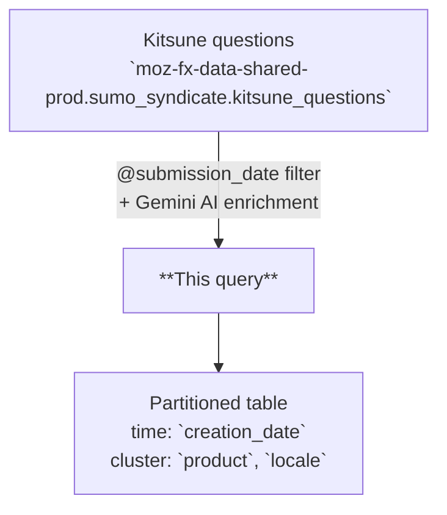

# Kitsune Embeddings

AI-enriched support question data from Kitsune (SUMO), one row per question per day. Combines original question fields with Gemini-generated summaries, classifications, sentiment scores, and vector embeddings.

---

## Overview

| | |
|---|---|
| **Grain** | One row per `(creation_date, title, content)` |
| **Source** | `moz-fx-data-shared-prod.sumo_syndicate.kitsune_questions` |
| **DAG** | `bqetl_analytics_tables` · daily · incremental |
| **Partitioning** | `creation_date` *(partition filter required)* |
| **Clustering** | `product`, `locale` |
| **Retention** | No automatic expiration |
| **Owner** | lvargas@mozilla.com |
| **Version** | v1 (initial version) |

**Use cases:** support question analysis · semantic search via embeddings · sentiment trend monitoring

---

## Data Flow



---

## How It Works

1. **Input** -- `kitsune_questions` provides one row per support question with title, content, locale, product, topic, solved status, and votes.
2. **AI generation** -- `AI.GENERATE_TABLE` with Gemini produces summary, category, language, entities, topics, and sentiment score for each question.
3. **Embedding** -- `AI.EMBED` with `gemini-embedding-001` generates a dense vector embedding from concatenated title and content.
4. **Scoring and metadata** -- A recency score is computed via exponential decay (7-day window), and a metadata struct captures model versions, quality scores, and a validation status flag.
5. **Data inclusion** -- All questions from the source are included for the given submission date; no bot or synthetic exclusions are applied.

---

## Key Fields

### Dimensions

| Category | Fields |
|---|---|
| Date | `creation_date` |
| Product & Topic | `product`, `topic`, `locale` |
| Content | `title`, `content`, `type` |
| Status | `is_solved` |

### Metrics and Generated Fields

| Category | Fields |
|---|---|
| Engagement | `votes` |
| AI-generated text | `summary_generated`, `category_generated`, `language_generated` |
| AI-generated arrays | `entities_generated`, `topics_generated` |
| Scores | `sentiment_score`, `recency_score` |
| Embedding | `embedding` |

---

## Example Queries

```sql
-- 1. Daily question volume and average sentiment by product
SELECT
  DATE(creation_date) AS day,
  product,
  COUNT(*) AS question_count,
  AVG(sentiment_score) AS avg_sentiment
FROM `moz-fx-data-shared-prod.customer_experience_derived.kitsune_retrieval_index_v1`
WHERE creation_date >= TIMESTAMP(DATE_SUB(CURRENT_DATE(), INTERVAL 7 DAY))
GROUP BY 1, 2
ORDER BY 1 DESC;
```

```sql
-- 2. Top AI-generated categories by locale with solve rate
SELECT
  locale,
  category_generated,
  COUNT(*) AS question_count,
  SAFE_DIVIDE(COUNTIF(is_solved), COUNT(*)) AS solve_rate
FROM `moz-fx-data-shared-prod.customer_experience_derived.kitsune_retrieval_index_v1`
WHERE creation_date >= TIMESTAMP(DATE_SUB(CURRENT_DATE(), INTERVAL 30 DAY))
GROUP BY 1, 2
ORDER BY question_count DESC;
```

```sql
-- 3. High-confidence negative sentiment questions for a specific product
SELECT
  DATE(creation_date) AS day,
  title,
  summary_generated,
  sentiment_score,
  metadata.model_output_confidence_score
FROM `moz-fx-data-shared-prod.customer_experience_derived.kitsune_embeddings_v1`
WHERE creation_date >= TIMESTAMP(DATE_SUB(CURRENT_DATE(), INTERVAL 7 DAY))
  AND product = 'Firefox'
  AND sentiment_score < -0.5
  AND metadata.model_output_confidence_score > 0.8
ORDER BY sentiment_score ASC
LIMIT 50;
```

---

## Implementation Notes

- Incremental: filtered by `@submission_date` parameter; one partition written per run.
- AI enrichment uses `AI.GENERATE_TABLE` (Gemini 2.5 Pro) and `AI.EMBED` (gemini-embedding-001) BigQuery ML functions.
- Rows are joined via SHA-256 hashes of normalized `(title, content, creation_date)` to handle formatting differences.
- The `metadata.status` field is set to SUCCESS only when all generated fields pass completeness and validity checks.
- No deduplication is applied; the source table provides one row per question.

---

## Notes & Conventions

- `type` is currently always "question"; future versions may include answers or other content types.
- `recency_score` uses exponential decay with a 7-day window: `EXP(-age_in_days / 7)`.
- `sentiment_score` ranges from -1.0 (very negative) to 1.0 (very positive), with 0 as neutral.
- `metadata.status` = "SUCCESS" when all AI-generated fields pass validation; "FAILED" otherwise.
- `embedding` is a dense float array suitable for cosine similarity or nearest-neighbor search.

---

## Schema & Related Tables

- Full field definitions: [`schema.yaml`](schema.yaml)
- **Upstream**: `moz-fx-data-shared-prod.sumo_syndicate.kitsune_questions` -- Kitsune (SUMO) support question data
- **Downstream**: Customer experience dashboards and semantic search applications
