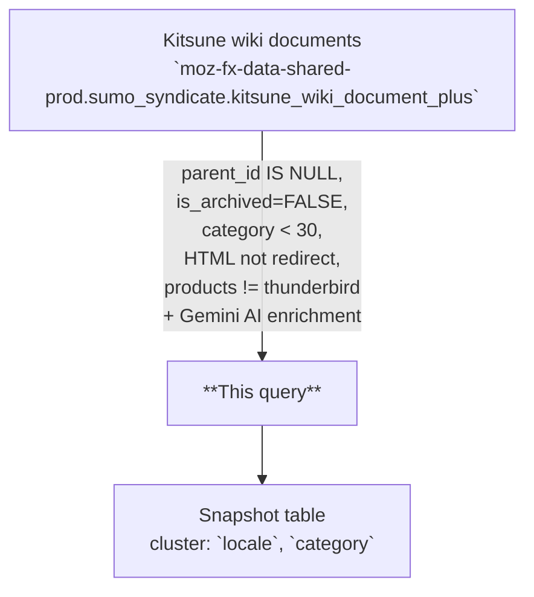

# Knowledge Base Retrieval Index

AI-enriched retrieval table derived from the Mozilla Support (SUMO) Knowledge Base, one row per article. Combines original article fields (title, HTML body, locale, products, topics, pageviews, revision pointers) with Gemini-generated summaries, classifications, and vector embeddings to support semantic search and grounded question answering over SUMO articles.

---

## 📌 Overview

| | |
|---|---|
| **Grain** | One row per Knowledge Base article (keyed by `id`) |
| **Source** | `moz-fx-data-shared-prod.sumo_syndicate.kitsune_wiki_document_plus` |
| **DAG** | `bqetl_analytics_tables` · daily · **rebuild-on-each-run (incremental reprocess)** |
| **Partitioning** | None (table is rebuilt each run by merging existing rows with newly processed rows) |
| **Clustering** | `locale`, `category` |
| **Retention** | No automatic expiration |
| **Owner** | lvargas@mozilla.com |
| **Version** | v1 (initial version) |

**Use cases:** support article analysis · semantic search via embeddings · grounded QA retrieval

---

## ⚠️ Analysis Caveats

> Read this section before writing queries. These are the most common sources of incorrect results.

- **Rebuilt every run by merging existing + newly processed rows.** The whole table is rewritten each run, but rows whose upstream `current_revision_id`, prior `embedding_succeeded`, and `model_version` / `embedding_version` / `prompt_version` all still match the current targets are carried forward as-is and skip the AI calls. Treat the table as a current-state snapshot of the KB corpus; there is no partition filter to apply and no per-day backfill workflow.
- **Originals only.** Translations are excluded upstream via `parent_id IS NULL`; you will not find non-English locale variants of the same article — the original (typically `en-US`) is the only row per article family.
- **Category filter is narrow.** Only categories with code `< 30` (user-facing categories per [Kitsune `config.py`](https://github.com/mozilla/kitsune/blob/3ddd61a2f32eb486388366874d42f9a860e357d8/kitsune/wiki/config.py#L87)) are included. Internal/contributor categories are excluded.
- **Redirects and Thunderbird are excluded.** Articles whose HTML matches `%REDIRECT%`, and any article whose `products` string contains `thunderbird`, are filtered out at source.
- **Reprocessing triggers.** A row is re-run when any of the following is true: (1) its upstream `current_revision_id` advanced, (2) its prior `metadata.embedding_succeeded = FALSE`, or (3) the current `llm_model` / `embedding_model` / `prompt_version` differs from the stored `metadata.model_version` / `embedding_version` / `prompt_version`. LLM-field issues do **not** trigger reruns — they are visible via `failure_reasons` for triage but never gate reprocessing.
- **Filter individual LLM columns when you need clean values.** `article_summary_llm`, `article_category_llm`, `article_entities_llm`, and `article_topics_llm` can each be NULL or empty independently.
- **For embedding/retrieval, filter on `metadata.embedding_succeeded`.** The consumer-facing view (`customer_experience.knowledge_base_retrieval_index`) enforces this automatically.
- **`products` is a raw upstream string, not a list.** Even when it visually contains a separator, treat the column as opaque text. There is no product-mappings join applied to this table; consumers needing normalized product names must do their own mapping.
- **Pageview counts reflect the last run.** `num_pageviews_last_{7|30|90|365}_days` are captured at the moment the snapshot was last written. Re-run to refresh.
- **Always embed query text with `gemini-embedding-001`.** Mixing embedding models produces mathematically meaningless distances.

---

## 🗺️ Data Flow



---

## 🧠 How It Works

1. **Input** — `kitsune_wiki_document_plus` provides one row per Knowledge Base article with title, HTML body, locale, products, topics, pageview counts, and revision pointers.
2. **AI generation** — `AI.GENERATE` with Gemini produces summary, category, entities, and topics per article from concatenated `title` and `content`.
3. **Embedding** — `AI.EMBED` with `gemini-embedding-001` generates a dense vector from concatenated `title` and `content`.
4. **Scoring and metadata** — A metadata struct captures model versions, quality scores, and a validation status flag. The `is_stale` flag is computed at read time by the `customer_experience.knowledge_base_retrieval_index` view (not stored in this table) from `last_approved_revision_date`.
5. **Data inclusion** — Only original (non-translated) articles, non-archived, in user-facing categories (`< 30`), with non-redirect HTML, and not tagged Thunderbird are included. No other bot/synthetic exclusions are applied.

---

## 🧾 Key Fields

### Dimensions

| Category | Fields |
|---|---|
| Identity | `id`, `slug`, `parent_id`, `current_revision_id`, `latest_localizable_revision_id` |
| Product & Topic | `products`, `topics`, `locale`, `category` |
| Content | `title`, `content`, `type` |
| Flags | `is_template`, `is_localizable`, `allow_discussion`, `needs_change` |
| Maintenance | `needs_change_comment`, `share_link`, `display_order`, `last_updated` |
| AI-generated | `article_summary_llm`, `article_category_llm`, `article_entities_llm`, `article_topics_llm` |

### Metrics

| Category | Fields |
|---|---|
| Pageviews | `num_pageviews_last_{7\|30\|90\|365}_days` |
| Scores | `is_stale` (view only) |
| Embedding | `embedding` |

---

## 🔍 Working with Embeddings

The `embedding` column is a dense float array produced by `AI.EMBED(CONCAT(title, ' ', content), endpoint => 'gemini-embedding-001')`. Use it to find articles similar to a free-text query, cluster KB topics, or power grounded QA retrieval.

> **Prerequisites:** running `AI.EMBED` on your own query text requires Vertex AI access and incurs BigQuery ML costs. Contact your data platform team if you hit permission errors.

**Semantic search with `VECTOR_SEARCH`:**

```sql
-- Find the 10 most semantically similar KB articles to a free-text query.
SELECT
  base.id,
  base.title,
  base.article_summary_llm,
  base.products,
  distance
FROM
  VECTOR_SEARCH(
    (
      SELECT *
      FROM `moz-fx-data-shared-prod.customer_experience.knowledge_base_retrieval_index`
      WHERE locale = 'en-US'
    ),
    'embedding',
    (
      SELECT
        AI.EMBED(
          'Firefox password manager not saving logins',
          endpoint => 'gemini-embedding-001'
        ).result AS embedding
    ),
    query_column_to_search => 'embedding',
    top_k => 10,
    distance_type => 'COSINE'
  )
ORDER BY distance ASC;
```

**Distance interpretation (cosine distance, lower = more similar):**

| Range | Meaning |
|---|---|
| < 0.3 | Strong match |
| 0.3 – 0.6 | Related |
| > 0.6 | Loosely related |

---

## 🧩 Example Queries

```sql
-- 1. Article counts by locale
SELECT
  locale,
  COUNT(*) AS article_count
FROM `moz-fx-data-shared-prod.customer_experience.knowledge_base_retrieval_index`
GROUP BY 1
ORDER BY article_count DESC;
```

```sql
-- 2. Top AI-generated categories by 30-day pageviews
SELECT
  article_category_llm,
  COUNT(*) AS article_count,
  SUM(num_pageviews_last_30_days) AS pageviews_30d,
  SAFE_DIVIDE(SUM(num_pageviews_last_30_days), COUNT(*)) AS avg_pageviews_per_article
FROM `moz-fx-data-shared-prod.customer_experience.knowledge_base_retrieval_index`
WHERE article_category_llm IS NOT NULL
GROUP BY 1
ORDER BY pageviews_30d DESC;
```

```sql
-- 3. Stale, high-traffic articles flagged for review (candidates for content refresh)
SELECT
  id,
  title,
  last_updated,
  num_pageviews_last_30_days,
  needs_change_comment
FROM `moz-fx-data-shared-prod.customer_experience.knowledge_base_retrieval_index`
WHERE needs_change = TRUE
  AND num_pageviews_last_30_days > 1000
ORDER BY num_pageviews_last_30_days DESC
LIMIT 50;
```

```sql
-- 4. Triage: which checks are firing most often?
SELECT
  reason,
  COUNT(*) AS row_count
FROM `moz-fx-data-shared-prod.customer_experience_derived.knowledge_base_retrieval_index_v1`,
  UNNEST(metadata.failure_reasons) AS reason
GROUP BY 1
ORDER BY row_count DESC;
```

---

## 🔧 Implementation Notes

- Rebuild-on-each-run with incremental reprocess: the entire table is rewritten on each run, but the query self-references the destination table — rows whose `current_revision_id`, `embedding_succeeded`, and model/prompt versions are unchanged are carried forward without re-running AI calls. No `@submission_date` parameter is used. On the first scheduled run after deploy (empty destination), every upstream row goes through AI processing.
- Source is read from the shared-prod syndicate: `sumo_syndicate.kitsune_wiki_document_plus`.
- Upstream filters: `parent_id IS NULL` (originals only), `is_archived = FALSE`, `category < 30` (user-facing), `html NOT LIKE '%REDIRECT%'`, and `products NOT LIKE '%thunderbird%'`.
- Reprocessing triggers: (a) `current_revision_id` advanced upstream, (b) prior `embedding_succeeded = FALSE`, (c) current `llm_model` / `embedding_model` / `prompt_version` differs from the stored `metadata.*` versions. LLM-field failures are recorded in `metadata.failure_reasons` for triage but never trigger reprocessing on their own.
- Articles deleted upstream (archived, Thunderbird-tagged, etc.) are dropped from the table naturally — both `unchanged` and `needs_processing` `JOIN base USING (id)`, so a missing upstream `id` produces no output row.
- `SAFE_DIVIDE` recommended for ratio calculations to avoid division-by-zero.

---

## 📌 Notes & Conventions

- `is_stale` is **only on the `customer_experience.knowledge_base_retrieval_index` view**, not on this underlying table. Computed as `DATE_DIFF(CURRENT_DATE(), last_approved_revision_date, MONTH) >= 12` — TRUE when the article's most recent approved revision is at least 12 months old. Mirrors the staleness threshold used by `sumo_metrics_derived.freshness_metrics_base_v1`. Always reflects staleness relative to the current query date.
- `product` the raw upstream Knowledge Base value. Normalization is applied at read time in the view.
- `type` is always "article"; future versions may include additional content types.
- `embedding` is a dense float array suitable for cosine similarity or nearest-neighbor search.

---

## 📋 Change Control

### Prompt version log

| `prompt_version` | Date | Summary |
|---|---|---|
| `v1` | 2026-05-13 | Initial — summary (8 words), category (1–2 words), entities (×3), topics (×3) |

### When to update

| What changed | Field to update in `query.sql` |
|---|---|
| Prompt text or `output_schema` in `AI.GENERATE` | `prompt_version` — increment to `v2`, `v3`, … |
| Generative model (currently `gemini-2.5-pro`) | `metadata.model_version` literal |
| Embedding model (currently `gemini-embedding-001`) | `metadata.embedding_version` literal + re-embed full history |

`prompt_version` is stored per row in `metadata.prompt_version`, so rows written under different prompts can be identified and re-processed. Add a row to this table for every change.

---

## 🗃️ Schema & Related Tables

- Full field definitions: [`schema.yaml`](schema.yaml)
- **Upstream**: `moz-fx-data-shared-prod.sumo_syndicate.kitsune_wiki_document_plus` — SUMO Knowledge Base wiki documents with enriched metadata (pageviews, revision pointers)
- **Downstream**: `moz-fx-data-shared-prod.customer_experience.knowledge_base_retrieval_index` — consumer-facing view with `is_stale` and `embedding_succeeded` filter applied
