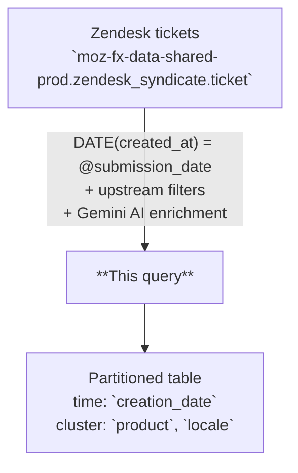

# Zendesk Retrieval Index

AI-enriched retrieval table derived from Zendesk customer support tickets, one row per ticket per creation date. Combines original ticket fields with Gemini-generated summaries, classifications, sentiment scores, and vector embeddings to support semantic search and grounded question answering over Mozilla support data.

---

## 📌 Overview

| | |
|---|---|
| **Grain** | One row per Zendesk ticket (keyed by `creation_date`, `ticket_id`) |
| **Source** | `moz-fx-data-shared-prod.zendesk_syndicate.ticket` (+ joins to `group`, `user`, `ticket_field_history`, `ticket_tag`, and `static.cx_product_mappings_v1`) |
| **DAG** | `bqetl_analytics_tables` · daily · incremental |
| **Partitioning** | `creation_date` *(partition filter required)* |
| **Clustering** | `product`, `locale` |
| **Retention** | No automatic expiration |
| **Owner** | lvargas@mozilla.com |
| **Version** | v1 (initial version) |

**Use cases:** support ticket analysis · semantic search via embeddings · sentiment trend monitoring

---

## ⚠️ Analysis Caveats

> Read this section before writing queries. These are the most common sources of incorrect results.

- **`creation_date` filter is required.** The table enforces a partition filter — omitting it will error or cause a full table scan.
- **The table excludes obvious noise, not real corpus.** Upstream filters drop: deleted tickets (`status != 'deleted'`), internal test/QA groups (`Sumo Test`, `VPN QA`), the Appbot non-English bucket (`ticket_group != 'Appbot - Non-English'`), and tickets tagged as tests (regex `(^|[-_])test([-_]|$)` or `qatest`). These filters are minimal; the rest of the corpus is otherwise complete.
- **`metadata.embedding_succeeded` is the *only* reprocessing driver.** Today this equals `embedding IS NOT NULL`. The reprocess job runs `WHERE NOT metadata.embedding_succeeded`. LLM-field issues do **not** trigger reruns — they are visible via `failure_reasons` for triage but never gate reprocessing.
- **Filter on individual LLM columns when you need clean values.** `ticket_summary_llm`, `ticket_category_llm`, `ticket_language_llm`, `ticket_entities_llm`, `ticket_topics_llm`, and `ticket_sentiment_score` can each be NULL or empty independently. If you're aggregating or grouping by one of them, filter `WHERE <col> IS NOT NULL` (and for arrays, `ARRAY_LENGTH(<col>) > 0`).
- **`ticket_sentiment_score` is NULL'd at write time when the model returns out-of-range values.** A NULL sentiment is either "model returned nothing" or "model returned >1 / <-1 and we discarded it." `metadata.failure_reasons` distinguishes the two: tags `ticket_sentiment_score_missing` vs `ticket_sentiment_score_out_of_range`.
- **`metadata.failure_reasons` lists every quality check that fired.** Tags include `embedding_missing`, `ticket_summary_llm_missing`, `ticket_category_llm_missing`, `ticket_language_llm_missing`, `ticket_sentiment_score_missing`, `ticket_sentiment_score_out_of_range`, `ticket_entities_llm_missing`, `ticket_entities_llm_has_empty_elements`, `ticket_topics_llm_missing`, `ticket_topics_llm_has_empty_elements`. Empty array when all checks pass. Use for model/prompt regression triage; **never** as a reprocessing condition.
- **For embedding/retrieval, filter on `embedding IS NOT NULL` (equivalent to `metadata.embedding_succeeded`) at minimum.** This is what the consumer-facing view (`customer_experience.zendesk_retrieval_index`) enforces.
- **Always embed query text with `gemini-embedding-001`.** Mixing embedding models produces mathematically meaningless distances.
- **`automation_category` reflects post-reopen recategorization.** Tickets initially flagged as automated but later reopened are recategorized as agent-handled (`automation_category = 0`).
- **`product`, `locale`, `custom_country`, `custom_category`, `via_channel`, `group_name` come from Zendesk fields and joined records.** Treat them as upstream-supplied dimensions; format/values may drift over time.

---

## 🗺️ Data Flow



---

## 🧠 How It Works

1. **Input** — `zendesk_syndicate.ticket` provides one row per ticket; rows are filtered to the partition matching `@submission_date`, then narrowed by the scope filters listed in Analysis Caveats.
2. **AI generation** — `AI.GENERATE` with Gemini produces summary, category, language, entities, topics, and sentiment score per ticket.
3. **Embedding** — `AI.EMBED` with `gemini-embedding-001` generates a dense vector from concatenated `title` and `content`.
4. **Automation classification** — `mozfun.customer_experience.is_automated` flags tickets resolved by automation; tickets that were later reopened are recategorized as agent-handled.
5. **Metadata** — A metadata struct captures model versions, prompt version, ingestion timestamp, embedding success flag, and quality-check failure reasons. The recency score is computed at read time by the `customer_experience.zendesk_retrieval_index` view (not stored in this table).

---

## 🧾 Key Fields

### Dimensions

| Category | Fields |
|---|---|
| Date | `creation_date`, `last_solved_at`, `closed_at` |
| Routing | `product`, `locale`, `custom_country`, `group_name`, `via_channel` |
| State | `status`, `custom_category`, `automation_category`, `type` |
| Content | `title`, `content` |
| AI-generated | `ticket_summary_llm`, `ticket_category_llm`, `ticket_language_llm`, `ticket_entities_llm`, `ticket_topics_llm` |

### Metrics

| Category | Fields |
|---|---|
| Ratings | `star_rating` |
| Latency | `resolution_latency_seconds` |
| Scores | `ticket_sentiment_score` (this table) · `recency_score` (view only) |
| Embedding | `embedding` |

---

## 🔍 Working with Embeddings

The `embedding` column is a dense float array produced by `AI.EMBED(CONCAT(title, ' ', content), endpoint => 'gemini-embedding-001')`. Use it to find tickets similar to a free-text query, cluster support topics, or power grounded QA retrieval.

> **Prerequisites:** running `AI.EMBED` on your own query text requires Vertex AI access and incurs BigQuery ML costs. Contact your data platform team if you hit permission errors.

**Semantic search with `VECTOR_SEARCH`:**

```sql
-- Find the 10 most semantically similar Firefox mobile tickets to a free-text query.
-- Notes:
--  • The partition filter (`creation_date >=`) MUST live inside the base subquery — the
--    underlying table requires a partition filter, and VECTOR_SEARCH scans `base` before
--    any outer WHERE is applied.
--  • The query embedding is passed as a one-row table paired with
--    `query_column_to_search => 'embedding'`.
SELECT
  base.ticket_id,
  base.title,
  base.ticket_summary_llm,
  base.product,
  distance
FROM
  VECTOR_SEARCH(
    (
      SELECT *
      FROM `moz-fx-data-shared-prod.customer_experience.zendesk_retrieval_index`
      WHERE creation_date >= DATE_SUB(CURRENT_DATE(), INTERVAL 30 DAY)
        AND product = 'firefox-android'
    ),
    'embedding',
    (
      SELECT
        AI.EMBED(
          'Firefox password manager not saving logins',
          endpoint => 'gemini-embedding-001'
        ).result AS embedding
    ),
    query_column_to_search => 'embedding',
    top_k => 10,
    distance_type => 'COSINE'
  )
ORDER BY distance ASC;
```

**Distance interpretation (cosine distance, lower = more similar):**

| Range | Meaning |
|---|---|
| < 0.3 | Strong match |
| 0.3 – 0.6 | Related |
| > 0.6 | Loosely related |

---

## 🧩 Example Queries

```sql
-- 1. Daily ticket volume and average sentiment by product
--    (ticket_sentiment_score is already NULL for missing/out-of-range rows, so AVG ignores them)
SELECT
  creation_date AS day,
  product,
  COUNT(*) AS ticket_count,
  AVG(ticket_sentiment_score) AS avg_sentiment
FROM `moz-fx-data-shared-prod.customer_experience.zendesk_retrieval_index`
WHERE creation_date >= DATE_SUB(CURRENT_DATE(), INTERVAL 7 DAY)
GROUP BY 1, 2
ORDER BY 1 DESC;
```

```sql
-- 2. Top AI-generated categories by product
SELECT
  product,
  ticket_category_llm,
  COUNT(*) AS ticket_count
FROM `moz-fx-data-shared-prod.customer_experience.zendesk_retrieval_index`
WHERE creation_date >= DATE_SUB(CURRENT_DATE(), INTERVAL 30 DAY)
  AND ticket_category_llm IS NOT NULL
GROUP BY 1, 2
ORDER BY ticket_count DESC;
```

```sql
-- 3. Negative-sentiment agent-handled tickets for a specific product
SELECT
  creation_date,
  title,
  ticket_summary_llm,
  ticket_sentiment_score
FROM `moz-fx-data-shared-prod.customer_experience.zendesk_retrieval_index`
WHERE creation_date >= DATE_SUB(CURRENT_DATE(), INTERVAL 7 DAY)
  AND product = 'firefox-android'
  AND automation_category = 0
  AND ticket_sentiment_score < -0.5
ORDER BY ticket_sentiment_score ASC
LIMIT 50;
```

```sql
-- 4. Triage: which checks are firing most often?
SELECT
  reason,
  COUNT(*) AS row_count
FROM `moz-fx-data-shared-prod.customer_experience_derived.zendesk_retrieval_index_v1`,
  UNNEST(metadata.failure_reasons) AS reason
WHERE creation_date >= DATE_SUB(CURRENT_DATE(), INTERVAL 7 DAY)
GROUP BY 1
ORDER BY row_count DESC;
```

```sql
-- 5. Operations: rows that need reprocessing (embedding failure only)
SELECT creation_date, ticket_id
FROM `moz-fx-data-shared-prod.customer_experience_derived.zendesk_retrieval_index_v1`
WHERE creation_date BETWEEN DATE('2026-04-01') AND DATE('2026-04-30')
  AND NOT metadata.embedding_succeeded;
```

---

## 🔧 Implementation Notes

- Incremental: one partition written per run, filtered by `DATE(ticket.created_at) = @submission_date`.
- Source is read from the shared-prod syndicate: `zendesk_syndicate.ticket`, with joins to `group`, `user`, `ticket_field_history`, `ticket_tag`, and `static.cx_product_mappings_v1`.
- **Appbot classification** uses `mozfun.customer_experience.classify_appbot_group` to tag tickets and exclude the `Appbot - Non-English` bucket.
- **Automation classification** uses `mozfun.customer_experience.is_automated`; tickets that transitioned `solved → open` (reopens) are recategorized as agent-handled.
- **Test-ticket exclusion** uses a tag regex (`(^|[-_])test([-_]|$)`) plus an explicit `qatest` match — narrower than a naive `LIKE '%test%'`.
- `metadata.embedding_succeeded` is the **only** reprocessing driver: re-runs are triggered exclusively by embedding failures. LLM-field failures are recorded in `metadata.failure_reasons` for triage but never trigger reprocessing.
- `ticket_sentiment_score` is NULLed at write time when the model returns a value outside `[-1, 1]`; the original out-of-range condition is preserved as the tag `ticket_sentiment_score_out_of_range` in `failure_reasons`.

---

## 📌 Notes & Conventions

- `recency_score` is **only on the `customer_experience.zendesk_retrieval_index` view**, not on this underlying table. It is computed at read time as `EXP(-DATE_DIFF(CURRENT_DATE(), creation_date, DAY) / 30)` — 30-day exponential decay; 1.0 for today, ~0.37 after 30 days. Always reflects freshness relative to the current query date, so backfills don't have to recompute it.
- `ticket_sentiment_score` ranges -1.0 (very negative) to 1.0 (very positive), 0 is neutral.
- `product` is normalized from raw Zendesk `custom_product` via `static.cx_product_mappings_v1` (source = 'Zendesk'); falls back to the raw value when no mapping exists.
- `type` is always "ticket"; future versions may include additional content types.
- `embedding` is a dense float array suitable for cosine similarity or nearest-neighbor search.

---

## 📋 Change Control

### Prompt version log

| `prompt_version` | Date | Summary |
|---|---|---|
| `v1` | 2026-04-29 | Initial — summary (8 words), category (1–2 words), language (BCP 47), entities (×3), topics (×3), sentiment score |

### When to update

| What changed | Field to update in `query.sql` |
|---|---|
| Prompt text or `output_schema` in `AI.GENERATE` | `prompt_version` — increment to `v2`, `v3`, … |
| Generative model (currently `gemini-2.5-pro`) | `` at the top of the file |
| Embedding model (currently `gemini-embedding-001`) | `` + re-embed full history |

`prompt_version` is stored per row in `metadata.prompt_version`, so rows written under different prompts can be identified and re-processed during backfills. Add a row to this table for every change.

---

## 🗃️ Schema & Related Tables

- Full field definitions: [`schema.yaml`](schema.yaml)
- **Upstream**: `moz-fx-data-shared-prod.zendesk_syndicate.ticket` — Zendesk customer support tickets (Fivetran sync)
- **Downstream**: `moz-fx-data-shared-prod.customer_experience.zendesk_retrieval_index` view (adds `recency_score`, filters to `metadata.embedding_succeeded`); customer experience dashboards and semantic search applications
