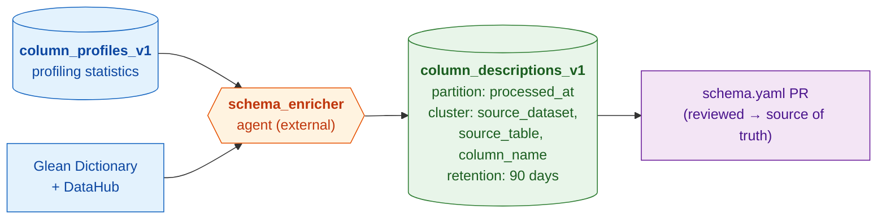

# Column Descriptions

Per-column descriptions for base tables, generated by reconciling probe
metadata and profiling statistics with LLM-assisted enrichment. Each row maps a
table column to its resolved description, source probe, and recommended base
schema promotion target. The enricher uses these rows to generate the
`schema.yaml` description changes proposed in a `bigquery-etl` pull request.

> **This table is not a source of truth.** Its only purpose is to stage the
> descriptions an enrichment run produced so they can be turned into a
> reviewable `schema.yaml` PR. Once that PR is opened — and especially after
> reviewers edit descriptions before merge — the canonical column descriptions
> live in `schema.yaml` in `bigquery-etl`, and the rows here become stale.
> Nothing downstream reads this table as authoritative.

## Architecture

This table is **not populated by a bqetl query**. It is written externally by
the [schema enricher agent](https://github.com/mozilla/data-shared-llm-agents/tree/main/agents/schema_enricher),
which runs in the `data-shared-llm-agents` repo. The agent reads profiling
statistics from the sibling `column_profiles_v1` table, resolves probe metadata
via the Glean Dictionary and DataHub, generates descriptions with an LLM, and
appends rows here.



## Write model

Each agent run **appends** rows with a new `processed_at` timestamp, capturing
the descriptions that run generated. Rows accumulate across runs purely as a
working record — they are never updated in place, and nothing treats them as
canonical (see the note above). To inspect what an enrichment run most recently
produced for a column, read the latest `processed_at` — but remember this is the
agent's raw output, which may differ from the reviewed `schema.yaml` that was
actually merged.

## Partitioning & retention

- **Partitioned** by `processed_at` (TIMESTAMP, daily granularity).
- **Clustered** by `source_dataset`, `source_table`, `column_name`.
- **Retained** for **90 days** (`expiration_days: 90`) — older partitions are
  auto-deleted by BigQuery. Since the table is a disposable staging artifact (see
  above), expiring old rows loses nothing authoritative; 90 days is just a
  generous cleanup horizon.

## Inspecting agent output

> [!WARNING]
> **Descriptions in this table may not match what is deployed in `schema.yaml`.**
> Reviewers can edit descriptions during PR review, so the merged `schema.yaml` —
> not this table — is the authoritative source.

For debugging only — to see what an enrichment run generated for a table (this is
also the read pattern `finalize_schema_pr` uses to assemble the PR).

```sql
SELECT column_name, final_description, matched_probe, routing_hint, contradiction
FROM `moz-fx-data-shared-prod.data_governance_metadata_derived.column_descriptions_v1`
WHERE source_dataset = 'telemetry_derived'
  AND source_table   = 'feature_usage_v2'
  AND processed_at >= CURRENT_TIMESTAMP() - INTERVAL 14 DAY
QUALIFY ROW_NUMBER() OVER (PARTITION BY column_name ORDER BY processed_at DESC) = 1;
```

Add `AND contradiction IS NOT NULL` to surface columns where the agent flagged a
conflict between observed profiling data and the probe definition.
