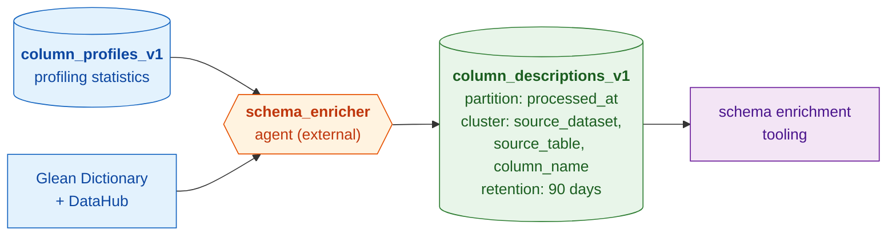

# Column Descriptions

Per-column descriptions for base tables, generated by reconciling probe
metadata and profiling statistics with LLM-assisted enrichment. Each row maps a
table column to its resolved description, source probe, and recommended base
schema promotion target. Consumed by schema enrichment tooling to populate
`schema.yaml` description fields.

## Architecture

This table is **not populated by a bqetl query**. It is written externally by
the [schema enricher agent](https://github.com/mozilla/data-shared-llm-agents/tree/main/agents/schema_enricher),
which runs in the `data-shared-llm-agents` repo. The agent reads profiling
statistics from the sibling `column_profiles_v1` table, resolves probe metadata
via the Glean Dictionary and DataHub, generates descriptions with an LLM, and
appends rows here.



## Write model

Each agent run **appends** rows with a new `processed_at` timestamp. Rows
accumulate across runs; the 90-day partition expiration automatically removes
old snapshots. Consumers should read the most recent `processed_at` per column
to get current descriptions.

## Partitioning & retention

- **Partitioned** by `processed_at` (TIMESTAMP, daily granularity).
- **Clustered** by `source_dataset`, `source_table`, `column_name`.
- **Retained** for **90 days** (`expiration_days: 90`) — older partitions are
  auto-deleted by BigQuery.

## Querying

Latest description for each column in a table:

```sql
SELECT column_name, final_description, matched_probe, routing_hint
FROM `moz-fx-data-shared-prod.data_governance_metadata_derived.column_descriptions_v1`
WHERE source_dataset = 'telemetry_derived'
  AND source_table   = 'feature_usage_v2'
  AND processed_at >= CURRENT_TIMESTAMP() - INTERVAL 14 DAY
QUALIFY ROW_NUMBER() OVER (PARTITION BY column_name ORDER BY processed_at DESC) = 1;
```

Columns with contradictions between profiling data and probe definitions:

```sql
SELECT source_table, column_name, contradiction, final_description
FROM `moz-fx-data-shared-prod.data_governance_metadata_derived.column_descriptions_v1`
WHERE source_dataset = 'telemetry_derived'
  AND contradiction IS NOT NULL
  AND processed_at >= CURRENT_TIMESTAMP() - INTERVAL 14 DAY
QUALIFY ROW_NUMBER() OVER (PARTITION BY source_table, column_name ORDER BY processed_at DESC) = 1;
```
