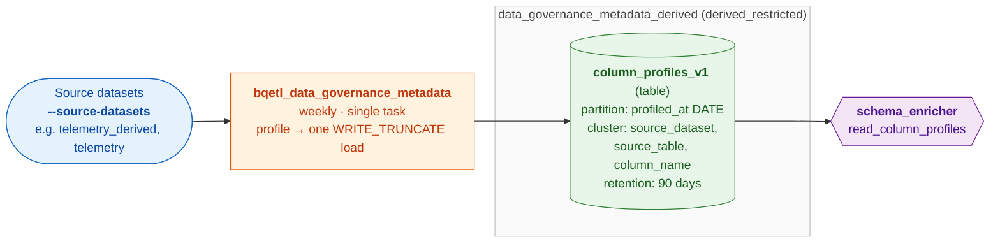

# Column Profiles

Per-column profiling statistics (null rate, approximate distinct count,
cardinality, example values, value/frequency distributions) for base tables
across Mozilla source datasets. Produced weekly and consumed by schema
enrichment tooling to generate accurate column descriptions.

## Architecture

A single weekly job profiles a configurable list of source datasets and writes
all rows to **one table**, `column_profiles_v1`, in
`data_governance_metadata_derived` (restricted to the
`dataplatform/data-governance-developers` workgroup), tagged with
`source_dataset`/`source_table`. Consumers read the table directly.



A single task accumulates every dataset's rows and overwrites the run's
`profiled_at` partition in **one** `WRITE_TRUNCATE` load — so reruns/backfills
are idempotent without the concurrent-DML contention a multi-writer shared
table would have.

## Querying `column_profiles_v1`

**Always filter on `profiled_at`** — it is the partition key, and a filter lets
BigQuery prune partitions. `source_dataset`/`source_table` are clustering keys,
so they speed up scans but do **not** prune partitions on their own.

Latest profile for one table's columns:

```sql
SELECT column_name, data_type, null_rate, distinct_count, example_value
FROM `moz-fx-data-shared-prod.data_governance_metadata_derived.column_profiles_v1`
WHERE source_dataset = 'telemetry_derived'
  AND source_table   = 'feature_usage_v2'
  AND profiled_at >= CURRENT_DATE() - INTERVAL 14 DAY   -- prunes to ~1-2 partitions
QUALIFY ROW_NUMBER() OVER (PARTITION BY column_name ORDER BY profiled_at DESC) = 1;
```

Low-cardinality value distribution for a column:

```sql
SELECT column_name, v.value, v.frequency
FROM `moz-fx-data-shared-prod.data_governance_metadata_derived.column_profiles_v1`,
     UNNEST(values) AS v
WHERE source_dataset = 'telemetry_derived'
  AND source_table   = 'feature_usage_v2'
  AND column_name    = 'normalized_channel'
  AND profiled_at >= CURRENT_DATE() - INTERVAL 14 DAY
ORDER BY v.frequency DESC;
```

Coverage snapshot for a dataset (how many columns profiled, by tier):

```sql
SELECT source_table, column_tier, COUNT(*) AS n_columns
FROM `moz-fx-data-shared-prod.data_governance_metadata_derived.column_profiles_v1`
WHERE source_dataset = 'telemetry_derived'
  AND profiled_at >= CURRENT_DATE() - INTERVAL 14 DAY
GROUP BY source_table, column_tier
ORDER BY source_table, column_tier;
```

> **Pruning note:** filtering only on `source_dataset` / `source_table` does
> *not* prune partitions (those are clustering keys, not the partition column).
> Including a `profiled_at` lower bound is what bounds the scan. `DATE(profiled_at)
> >= …` also works and prunes.

## Schema

| Column | Type | Mode | Description |
|---|---|---|---|
| `source_project` | STRING | REQUIRED | GCP project of the profiled table. |
| `source_dataset` | STRING | REQUIRED | Dataset of the profiled table. |
| `source_table` | STRING | REQUIRED | Table name (no project/dataset). |
| `column_name` | STRING | REQUIRED | Field path, dot notation for nested fields. |
| `data_type` | STRING | REQUIRED | BigQuery data type from INFORMATION_SCHEMA. |
| `null_rate` | FLOAT | NULLABLE | Percentage of rows where the column is NULL. |
| `distinct_count` | INTEGER | NULLABLE | Approximate distinct non-null values. |
| `is_high_cardinality` | BOOLEAN | NULLABLE | True if `distinct_count` > 50. |
| `example_value` | STRING | NULLABLE | Representative value (high-cardinality columns only). |
| `values` | RECORD (REPEATED) | | `value`/`frequency` pairs — full distribution for low-cardinality columns (distinct_count ≤ 50), or the top 5 values for high-cardinality columns (which also set `example_value`). |
| `column_tier` | STRING | NULLABLE | `scalar`, `leaf`, `nested_leaf`, `scalar_array`, `undocumented`, or `pii_suppressed`. |
| `profiled_at` | DATE | REQUIRED | Run date of the profiling job; the partition key. |

PII-named columns are never scanned — they appear with `column_tier =
'pii_suppressed'` and no statistics. Tables with more than 500 columns are
skipped (too wide to profile in one pass) and simply produce no rows.

## Partitioning & retention

`column_profiles_v1` is:

- **Partitioned** by `profiled_at` (DATE, daily granularity).
- **Clustered** by `source_dataset`, `source_table`, `column_name`.
- **Retained** for **90 days** (`expiration_days: 90`) — roughly the last ~13
  weekly snapshots; older partitions are auto-deleted by BigQuery. Consumers
  read the latest snapshot, so history is kept only for drift analysis.

## Scheduling

The job runs on the **`bqetl_data_governance_metadata`** DAG, weekly (Mondays
04:00 UTC). It profiles the datasets configured in `metadata.yaml` (e.g.
`telemetry_derived`, `telemetry`); each run profiles every base table in those
datasets (1% `sample_id` sampling and a 7-day partition filter bound the scan)
and overwrites that run's `profiled_at` partition.

The scheduled `profiled_at` date is the run's **interval-end** date
(`data_interval_end`), i.e. the Monday the run executes on — not Airflow's
default `logical_date` (which is the interval *start*, the prior Monday). The
source data scanned is then `profiled_at − 7 days`. So the Monday **Jun 15**
run writes `profiled_at = 2026-06-15` and scans the **Jun 8** source partition.

## Running with a custom date / datasets

`date` and `source_datasets` are **per-run parameters**.

### Ad-hoc, in Airflow — "Trigger DAG w/ config" trigger for DAG `bqetl_data_governance_metadata`
Paste a JSON config — **both keys are required for manual runs**:

```json
{"date": "2026-06-01", "source_datasets": "fenix,firefox_desktop"}
```

- `date` — profiling date, (format: `YYYY-MM-DD`). Written as the `profiled_at` partition;
  the source data scanned is `date` − 7 days. **Required for manual runs** — the task
  fails fast if a manual ("Trigger DAG w/ config") run omits it. (This guards against the
  surprising partition date Airflow would otherwise infer from a manual trigger's interval.)
  Scheduled/backfill runs omit it and derive it from the run's interval-end date
  (`data_interval_end` — the scheduled run's Monday) automatically.
- `source_datasets` — comma-separated dataset names (commas only) whose tables are
  profiled. **Required for manual runs** — the task fails fast if omitted (forces
  deliberate scoping of ad-hoc runs). Scheduled/backfill runs omit it and use the
  job's default set (`telemetry_derived,telemetry`, set in `metadata.yaml`).

### For permanent job runs:
Edit the `source_datasets` in
[`metadata.yaml`](./metadata.yaml):

```yaml
scheduling:
  arguments: [
    "--date", "{{ dag_run.conf.get('date', (data_interval_end | ds) if dag_run.run_type != 'manual' else '') }}",
    "--source-datasets", "{{ dag_run.conf.get('source_datasets', 'telemetry_derived,telemetry,firefox_desktop' if dag_run.run_type != 'manual' else '') }}"
  ]
```
then regenerate the DAG (`./bqetl dag generate bqetl_data_governance_metadata`).


> `--source-datasets` takes a **single comma-separated** value (so it can be
> driven by `dag_run.conf`), e.g. `"telemetry_derived,telemetry"`. Commas are the
> only separator — a space-separated value is rejected as an invalid dataset name.

### Profiling a subset of tables (manual / scoped runs)

`query.py` accepts `--tables`, but it **requires exactly one
`--source-datasets` entry** (table names are ambiguous across datasets). These
runs are for one-off/scoped profiling; the scheduled job omits `--tables` and
profiles all base tables in each dataset.

**Via bqetl** (`bqetl query run` does not support `query.py` — use `backfill`,
which runs the script's `main` entrypoint; `--project-id` is required, and each
script arg is passed as a separate `--query-script-arg`):

```bash
./bqetl query backfill data_governance_metadata_derived.column_profiles_v1 \
  --project-id moz-fx-data-shared-prod \
  --start-date 2026-06-04 --end-date 2026-06-04 \
  --query-script-entrypoint main \
  --query-script-date-arg date \
  --query-script-arg "--source-datasets" --query-script-arg "telemetry_derived" \
  --query-script-arg "--tables" \
  --query-script-arg "feature_usage_v2" --query-script-arg "clients_first_seen_v3"
```

**Directly** (simplest for ad-hoc dev; bypasses bqetl, runs in the repo venv):

```bash
./venv/bin/python sql/moz-fx-data-shared-prod/data_governance_metadata_derived/column_profiles_v1/query.py \
  --date 2026-06-04 --source-datasets telemetry_derived \
  --tables feature_usage_v2 clients_first_seen_v3
```

Both write a single `WRITE_TRUNCATE` partition for the given date, so re-running
is idempotent.

**Dry run** — preview which tables would be profiled without running any
profiling query or writing to BigQuery. Add `--dry-run` to the direct form, or
`--query-script-arg "--dry-run"` to the bqetl form (bqetl's own `--dry-run` is
not compatible with `query.py` jobs, so it must be passed through to the script):

```bash
./venv/bin/python sql/moz-fx-data-shared-prod/data_governance_metadata_derived/column_profiles_v1/query.py \
  --date 2026-06-04 --source-datasets telemetry_derived --dry-run
```

## Consumers

The `schema_enricher` agent (in the `data-shared-llm-agents` repo) reads
`column_profiles_v1` via its `read_column_profiles` tool, which selects the most
recent snapshot per column using the 14-day partition-pruning window shown above.
