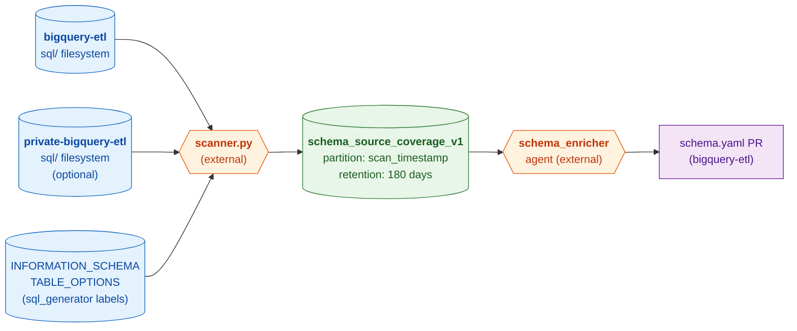

# Schema Source Coverage

Per-table schema coverage scan for bqetl datasets. For each table directory in
`sql/<project>/<dataset>/`, records whether a `schema.yaml` exists, which
upstream source table(s) the query pulls from, and whether those source schemas
have complete field descriptions. The schema enricher reads this table to decide
which tables to enrich and where to find source descriptions to propagate via
`!include-field-description` tags.

## Architecture

This table is **not populated by a bqetl query**. It is written externally by
the [schema enricher scanner](https://github.com/mozilla/data-shared-llm-agents/tree/main/agents/schema_enricher/src/schema_enricher/scanner.py),
which walks the `bigquery-etl` and `private-bigquery-etl` filesystems, traces
each table's `query.sql` or `view.sql` upstream through views to reach versioned
(`_vN`) or raw (`_live`/`_stable`) leaf tables, and looks up `sql_generator`
labels from `INFORMATION_SCHEMA.TABLE_OPTIONS`.



## Source tracing

For each table, the scanner reads `query.sql` or `view.sql` and extracts
backtick-quoted 3-part table references. References that are not versioned
(`_vN`) or raw (`_live`/`_stable`) are recursively traced through their own SQL
files until a leaf is reached. Each leaf produces one output row. Tables with
multiple sources in their `FROM` clause produce multiple rows (one per resolved
leaf).

When all upstream references are raw (`_live`/`_stable`) tables with no bqetl
directory, the most upstream bqetl-managed directory is reported as the source —
this is the table the enricher should enrich directly.

## Write model

Each scanner run **appends** rows with a new `scan_timestamp`. Multiple dataset
scans accumulate. To read the current state for a dataset, filter to the latest
`scan_timestamp`:

```sql
SELECT *
FROM `moz-fx-data-shared-prod.data_governance_metadata_derived.schema_source_coverage_v1`
WHERE dataset = 'my_dataset'
  AND scan_timestamp = (
    SELECT MAX(scan_timestamp)
    FROM `moz-fx-data-shared-prod.data_governance_metadata_derived.schema_source_coverage_v1`
    WHERE dataset = 'my_dataset'
  )
```

## Partitioning & retention

- **Partitioned** by `scan_timestamp` (TIMESTAMP, daily granularity).
- **Retained** for **180 days** — set as the default partition expiration on the
  table outside this script. Old scans expire automatically; only the most recent
  scan per dataset is operationally relevant.

## Key columns

| Column | Description |
|---|---|
| `project` / `dataset` / `table` | Identity of the scanned table |
| `is_view` | True when the table directory contains `view.sql` |
| `sql_generator` | Name of the sql_generator label if the table was generated (e.g. `glean_usage`); null for hand-written tables |
| `schema_defined_in_bqetl` | True when a `schema.yaml` exists for this table |
| `source_schema_directory` | Filesystem path to the resolved upstream source directory; null when no source was found |
| `source_schema_fully_described` | True when every field in the source `schema.yaml` has a description |
| `source_schema_is_private` | True when the source lives in `private-bigquery-etl` |

## Example: find tables ready for enrichment

Tables that have a `schema.yaml` but whose source schema is not fully described
— these are candidates for the enricher to process:

```sql
SELECT project, dataset, table, source_schema_directory, source_schema_is_private
FROM `moz-fx-data-shared-prod.data_governance_metadata_derived.schema_source_coverage_v1`
WHERE dataset = 'telemetry_derived'
  AND schema_defined_in_bqetl = TRUE
  AND is_view = FALSE
  AND sql_generator IS NULL
  AND (source_schema_fully_described = FALSE OR source_schema_directory IS NULL)
  AND scan_timestamp = (
    SELECT MAX(scan_timestamp)
    FROM `moz-fx-data-shared-prod.data_governance_metadata_derived.schema_source_coverage_v1`
    WHERE dataset = 'telemetry_derived'
  )
ORDER BY table
```
