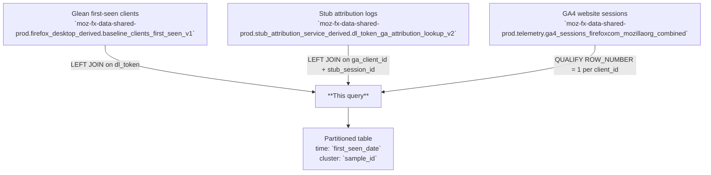

# Clients First Seen with GA4 Attributes

One row per Firefox Desktop client, joining the Glean `baseline_clients_first_seen` record to the GA4 website session that preceded the download, via the stub attribution download token. Covers attribution data from both the Firefox installer and the Mozilla/Firefox.com website visit that led to the download.

---

## 📌 Overview

| | |
|---|---|
| **Grain** | One row per `client_id` (deduplicated; first match by stub session priority) |
| **Source** | `moz-fx-data-shared-prod.firefox_desktop_derived.baseline_clients_first_seen_v1` |
| **DAG** | `bqetl_google_analytics_derived_ga4` · daily · full-refresh |
| **Partitioning** | `first_seen_date` *(no partition filter required)* |
| **Clustering** | `sample_id` |
| **Retention** | No automatic expiration |
| **Owner** | kik@mozilla.com |
| **Version** | v1 (initial version) |

**Use cases:** Marketing attribution analysis · GA4 campaign performance vs. Firefox installs · Download funnel analysis

---

## 🗺️ Data Flow



---

## 🧠 How It Works

1. **Input** — `baseline_clients_first_seen_v1` has one row per Glean client, representing the first-ever ping received from that Firefox Desktop install.
2. **Stub attribution join** — `attribution_ext.dltoken` is extracted from the client's installer attribution and matched to `dl_token_ga_attribution_lookup_v2` to retrieve the corresponding `ga_client_id` and `stub_session_id`.
3. **GA4 session join** — the resolved `ga_client_id` + `stub_session_id` pair is joined to `ga4_sessions_firefoxcom_mozillaorg_combined` (unnested from `all_reported_stub_session_ids`) to attach website campaign and ad data.
4. **Deduplication** — `QUALIFY ROW_NUMBER() OVER (PARTITION BY cfs.client_id ORDER BY has_stub_session_id DESC, ga4.stub_session_id ASC) = 1` ensures one row per client, preferring rows with a matched GA4 stub session.
5. **Data inclusion** — All Firefox Desktop clients from `baseline_clients_first_seen_v1` are included. GA4 join is optional (LEFT JOIN); clients without a matched download token or GA4 session have NULL in all `ga4_*` and `stub_attr_logs_*` fields. BrowserStack and MozillaOnline clients are flagged via `is_desktop = FALSE`.

---

## 🧾 Key Fields

### Dimensions

| Category | Fields |
|---|---|
| Date & Geo | `first_seen_date`, `submission_date`, `country`, `ga4_country`, `ga4_region`, `ga4_city` |
| Browser | `normalized_os`, `normalized_os_version`, `normalized_channel`, `app_display_version`, `windows_version` |
| Attribution | `attribution_{campaign\|medium\|source\|content\|term}`, `attribution_dlsource`, `attribution_dltoken` |
| GA4 Traffic Source | `ga4_manual_{campaign_name\|source\|medium\|content\|term}`, `ga4_first_{campaign\|source\|medium}_from_event_params` |
| GA4 Ad | `ga4_ad_google_campaign`, `ga4_gclid`, `ga4_ad_crosschannel_{source\|medium\|campaign}` |
| User | `client_id`, `sample_id`, `locale`, `isp`, `distribution_id`, `is_desktop` |

### Metrics

| Category | Fields |
|---|---|
| Download events | `ga4_had_download_event`, `ga4_firefox_desktop_downloads` |
| Install targets | `ga4_last_reported_install_target`, `ga4_all_reported_install_targets` |
| Session identifiers | `ga4_stub_session_id`, `stub_attr_logs_stub_session_id`, `stub_attr_logs_dl_token` |

---

## 🧩 Example Queries

```sql
-- 1. Firefox Desktop new installs per day by GA4 traffic source
SELECT
  first_seen_date,
  ga4_manual_source,
  COUNT(DISTINCT client_id) AS new_installs
FROM `moz-fx-data-shared-prod.firefox_desktop_derived.cfs_ga4_attr_v1`
WHERE first_seen_date >= DATE_SUB(CURRENT_DATE(), INTERVAL 30 DAY)
GROUP BY 1, 2
ORDER BY 1 DESC, new_installs DESC;
```

```sql
-- 2. GA4 channel group breakdown of new installs with GA4 match rate
SELECT
  ga4_ad_crosschannel_default_channel_group,
  COUNT(DISTINCT client_id) AS new_installs,
  SAFE_DIVIDE(
    COUNTIF(ga4_ga_client_id IS NOT NULL),
    COUNT(DISTINCT client_id)
  ) AS ga4_match_rate
FROM `moz-fx-data-shared-prod.firefox_desktop_derived.cfs_ga4_attr_v1`
WHERE first_seen_date = DATE_SUB(CURRENT_DATE(), INTERVAL 1 DAY)
GROUP BY 1
ORDER BY new_installs DESC;
```

```sql
-- 3. Google Ads campaign performance — installs with download events by campaign
SELECT
  first_seen_date,
  ga4_ad_google_campaign,
  COUNT(DISTINCT client_id) AS new_installs,
  COUNTIF(ga4_had_download_event) AS sessions_with_download,
  SAFE_DIVIDE(COUNTIF(ga4_had_download_event), COUNT(DISTINCT client_id)) AS download_rate
FROM `moz-fx-data-shared-prod.firefox_desktop_derived.cfs_ga4_attr_v1`
WHERE first_seen_date >= DATE_SUB(CURRENT_DATE(), INTERVAL 7 DAY)
  AND ga4_ad_google_campaign IS NOT NULL
GROUP BY 1, 2
ORDER BY 1 DESC, new_installs DESC;
```

---

## 🔧 Implementation Notes

- Full-refresh table; no incremental `@submission_date` parameter. The entire table is rewritten on each DAG run. Partitioning is by `first_seen_date`.
- Deduplication via `QUALIFY ROW_NUMBER() OVER (PARTITION BY cfs.client_id ...) = 1` — rows with a matched GA4 stub session (`has_stub_session_id = 1`) are preferred; ties broken by `ga4.stub_session_id ASC`.
- GA4 join requires a valid `dltoken` in `attribution_ext`, a matching row in stub attribution logs (non-null `ga_client_id`, `stub_session_id`, `dl_token`), and a matching GA4 session. All three joins are LEFT JOINs; missing matches produce NULLs.
- `is_desktop` is `FALSE` for BrowserStack clients (`isp = 'browserstack'`) and MozillaOnline distribution clients (`distribution_id = 'mozillaonline'`).
- Use `SAFE_DIVIDE` for any rate/ratio calculations to avoid division-by-zero when filtering to subsets.

---

## 📌 Notes & Conventions

- `attribution_dltoken` = `JSON_VALUE(attribution_ext.dltoken)` — the join key between the Firefox installer and the stub attribution service log; NULL means no stub attribution match.
- `stub_attr_logs_*` fields = NULL when no matching row exists in `dl_token_ga_attribution_lookup_v2` for this client's download token.
- `ga4_*` fields = NULL when no GA4 session matched via `ga_client_id` + `stub_session_id`; this is expected for organic/direct installs without website session tracking.
- `ga4_website` = `'FIREFOX.COM'` or `'MOZILLA.ORG'` — indicates which Mozilla property the pre-download session occurred on.
- `ga4_had_download_event` = whether a Firefox download event was recorded in the matched GA4 session (BOOLEAN; NULL if no GA4 match).

---

## 🗃️ Schema & Related Tables

- Full field definitions: [`schema.yaml`](schema.yaml)
- **Upstream**: `moz-fx-data-shared-prod.firefox_desktop_derived.baseline_clients_first_seen_v1` — one row per Glean Firefox Desktop client from first ping received
- **Upstream**: `moz-fx-data-shared-prod.stub_attribution_service_derived.dl_token_ga_attribution_lookup_v2` — maps download tokens to GA client and stub session identifiers
- **Upstream**: `moz-fx-data-shared-prod.telemetry.ga4_sessions_firefoxcom_mozillaorg_combined` — GA4 session-level data from firefox.com and mozilla.org combined
- **Downstream**: Used for marketing attribution, paid acquisition analysis, and Firefox Desktop install funnel reporting
