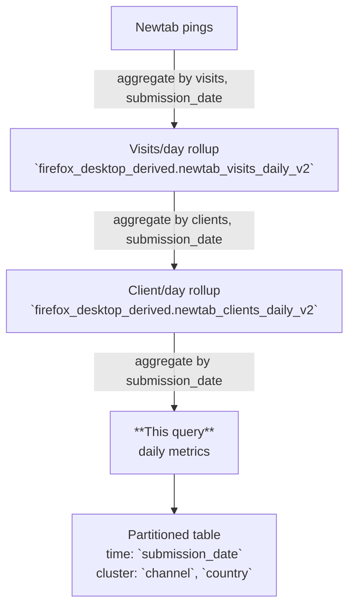

# Newtab Daily Aggregations

> A **daily aggregation** of Firefox Desktop New Tab metrics. Each row summarizes engagement for one `submission_date` across user, content, and UI dimensions.

---

## 🗺️ Data Flow


*This job reads from `moz-fx-data-shared-prod.firefox_desktop_derived.newtab_clients_daily_v2` and groups by the daily dimension set.*

---

## 🧩 Dimensions (Group By)
- `submission_date`, `app_version`, `os`, `channel`, `locale`, `country`
- `homepage_category`, `newtab_category`
- feature flags: `organic_content_enabled`, `sponsored_content_enabled`, `sponsored_topsites_enabled`, `organic_topsites_enabled`, `newtab_search_enabled`

## 📊 Key Metrics
- **Visits & Clients:** `all_visits`, `newtab_clients`, `default_ui_visits`, `default_ui_clients`
- **Engagement:** overall & non-search (`any_engagement_*`, `nonsearch_engagement_*`)
- **Content:** organic vs sponsored clicks, impressions, engagement; **dismissals**, **thumbs up/down**
- **Topsites:** organic vs sponsored engagement, clicks, impressions, dismissals
- **Search:** ad clicks & impressions; total search interactions
- **Widgets & Others:** engagement, interaction, impression counts (others includes wallpaper, topic_selection, sections)

> New **Phase 4** fields include dismissal and thumb-vote metrics for content and topsites, plus search ad metrics.

---

## 🧠 How It Works (Query Summary)
- Filters to a single day via parameter **`@submission_date`**.
- Aggregates counts and distinct client tallies from the client/day rollup source.
- Produces daily metrics partitioned by `submission_date`; clustering on `channel`, `country` per metadata.

---

## 🧪 Example Usage

```sql
-- Daily content engagement by country
SELECT
  submission_date,
  country,
  SUM(any_content_engagement_visits) AS visits_with_content,
  SUM(any_content_click_count) AS clicks_on_content
FROM `moz-fx-data-shared-prod.firefox_desktop_derived.newtab_daily_aggregations`
WHERE submission_date BETWEEN DATE_SUB(@day, INTERVAL 7 DAY) AND @day
GROUP BY 1, 2
ORDER BY 1, 2;
```

```sql
-- Sponsored vs Organic topsites (last 14 days, release channel only)
SELECT
  submission_date,
  SUM(sponsored_topsite_impression_count) AS sponsored_impr,
  SUM(organic_topsite_impression_count)   AS organic_impr
FROM `moz-fx-data-shared-prod.firefox_desktop_derived.newtab_daily_aggregations`
WHERE submission_date BETWEEN DATE_SUB(@day, INTERVAL 14 DAY) AND @day
  AND channel = 'release'
GROUP BY 1
ORDER BY 1;
```

> See `schema.yaml` for complete field definitions and descriptions.

---

## ⚙️ Scheduling
- Runs **daily** via DAG **`bqetl_newtab`**; incremental build.

---

## 📌 Notes & Conventions
- `*_clients` = distinct clients with ≥1 qualifying visit on that day.
- `*_visits` = number of visits with ≥1 qualifying event on that day.
- `*_count` = sum of individual events (e.g., clicks, impressions, dismissals).
