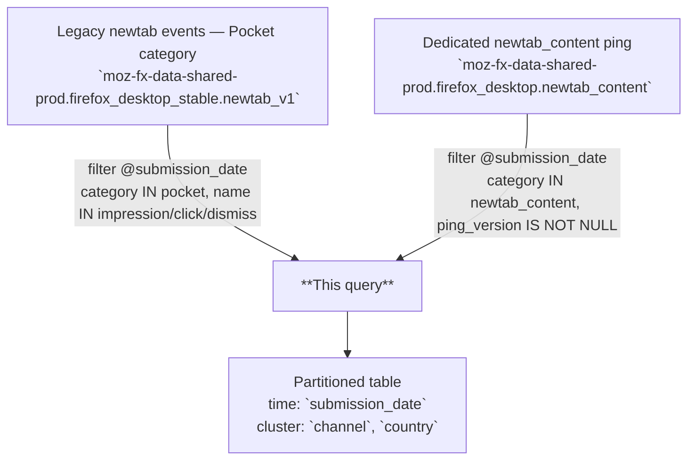

# Newtab Content Items Daily

Daily aggregation of Pocket/newtab content item actions (impressions, clicks, dismissals) for Firefox desktop, one row per unique combination of date, surface, corpus item, position, and dimensional attributes.

---

## 📌 Overview

| | |
|---|---|
| **Grain** | One row per `(submission_date, channel, country, newtab_content_surface_id, corpus_item_id, position, is_sponsored, is_section_followed, matches_selected_topic, received_rank, section, section_position, topic, content_redacted, newtab_content_ping_version, app_version)` |
| **Source** | `moz-fx-data-shared-prod.firefox_desktop_stable.newtab_v1` + `moz-fx-data-shared-prod.firefox_desktop.newtab_content` |
| **DAG** | `bqetl_newtab` · daily · incremental |
| **Partitioning** | `submission_date` *(partition filter required)* |
| **Clustering** | `channel`, `country` |
| **Retention** | No automatic expiration |
| **Owner** | lmcfall@mozilla.com |
| **Version** | v1 (initial version) |

**Use cases:** Pocket content engagement analysis · sponsored vs. organic item performance · section and topic click-through rates

---

## 🗺️ Data Flow



---

## 🧠 How It Works

1. **Input** — Events are unnested from two sources: legacy `newtab_v1` (Pocket category, app version ≥ 121) and the dedicated `newtab_content` ping (filtered to non-null ping version to confirm Newtab Content ping origin).
2. **Flattening** — Event extra fields (`corpus_item_id`, `position`, `is_sponsored`, `section`, `topic`, etc.) are extracted via `mozfun.map.get_key` and cast to their target types.
3. **Surface resolution** — `newtab_content_surface_id` is resolved using `mozfun.newtab.surface_id_country()`; for legacy events with no surface ID, `mozfun.newtab.scheduled_surface_id_v1()` is used as fallback.
4. **Aggregation** — Events are grouped by all dimensional keys; `COUNTIF(event_name = 'impression/click/dismiss')` produces the three metric columns.
5. **Data inclusion** — Legacy source excludes `content_redacted = 'true'` events (those are counted in the newtab_content ping path). Only app version ≥ 121 is included from the legacy source to prevent duplicates from pre-Glean releases.

---

## 🧾 Key Fields

### Dimensions

| Category | Fields |
|---|---|
| Date & Geo | `submission_date`, `country` |
| Browser | `channel`, `app_version` |
| Newtab config | `newtab_content_surface_id`, `newtab_content_ping_version`, `content_redacted` |
| Item | `corpus_item_id`, `position`, `received_rank`, `is_sponsored`, `topic` |
| Section | `section`, `section_position`, `is_section_followed`, `matches_selected_topic` |

### Metrics

| Category | Fields |
|---|---|
| Engagement | `impression_count`, `click_count`, `dismiss_count` |

---

## 🧩 Example Queries

```sql
-- 1. Daily total impressions, clicks, and dismissals for the last 7 days
SELECT
  submission_date,
  SUM(impression_count) AS impressions,
  SUM(click_count) AS clicks,
  SUM(dismiss_count) AS dismissals
FROM `moz-fx-data-shared-prod.firefox_desktop_derived.newtab_content_items_daily_v1`
WHERE submission_date >= DATE_SUB(CURRENT_DATE(), INTERVAL 7 DAY)
GROUP BY 1
ORDER BY 1 DESC;
```

```sql
-- 2. Click-through rate by topic for a single day
SELECT
  submission_date,
  topic,
  SUM(impression_count) AS impressions,
  SUM(click_count) AS clicks,
  SAFE_DIVIDE(SUM(click_count), SUM(impression_count)) AS ctr
FROM `moz-fx-data-shared-prod.firefox_desktop_derived.newtab_content_items_daily_v1`
WHERE submission_date = DATE_SUB(CURRENT_DATE(), INTERVAL 1 DAY)
GROUP BY 1, 2
ORDER BY impressions DESC;
```

```sql
-- 3. Sponsored vs. organic engagement by country over the last 30 days
SELECT
  submission_date,
  country,
  is_sponsored,
  SUM(impression_count) AS impressions,
  SUM(click_count) AS clicks,
  SUM(dismiss_count) AS dismissals,
  SAFE_DIVIDE(SUM(click_count), SUM(impression_count)) AS ctr
FROM `moz-fx-data-shared-prod.firefox_desktop_derived.newtab_content_items_daily_v1`
WHERE submission_date >= DATE_SUB(CURRENT_DATE(), INTERVAL 30 DAY)
  AND country = 'US'
GROUP BY 1, 2, 3
ORDER BY 1 DESC, impressions DESC;
```

---

## 🔧 Implementation Notes

- Incremental: filtered by `@submission_date`; one partition written per run.
- Two source paths are unioned: legacy newtab ping (Pocket events, app version ≥ 121) and the dedicated newtab_content ping (identified by non-null `newtab_content_ping_version`).
- `content_redacted = 'true'` rows are excluded from the legacy source path; those events are captured instead via the newtab_content ping to avoid double-counting.
- Country is resolved via `mozfun.newtab.surface_id_country()` rather than Fastly relay IP (`normalized_country_code`) for the newtab_content ping path.
- Use `SAFE_DIVIDE()` for all CTR/ratio calculations to avoid division-by-zero on rows with zero impressions.

---

## 📌 Notes & Conventions

- `impression_count` = `COUNTIF(event_name = 'impression')` — total item impressions per dimensional group.
- `click_count` = `COUNTIF(event_name = 'click')` — total item clicks per dimensional group.
- `dismiss_count` = `COUNTIF(event_name = 'dismiss')` — total item dismissals per dimensional group.
- `corpus_item_id` is the canonical Newtab content identifier, replacing legacy `tile_id` and `scheduled_corpus_item_id`.
- `newtab_content_ping_version` is NULL for rows sourced from the legacy newtab ping; non-null values indicate the dedicated Newtab Content ping.
- `content_redacted` is NULL for newtab_content ping rows; `'false'` for legacy newtab ping rows included in this table.

---

## 🗃️ Schema & Related Tables

- Full field definitions: [`schema.yaml`](schema.yaml)
- **Upstream (legacy)**: `moz-fx-data-shared-prod.firefox_desktop_stable.newtab_v1` — raw Glean newtab ping events for Firefox desktop
- **Upstream (content ping)**: `moz-fx-data-shared-prod.firefox_desktop.newtab_content` — dedicated newtab content ping with item-level detail
- **Downstream**: Used by Pocket/Newtab teams for content performance reporting and recommendation quality analysis
