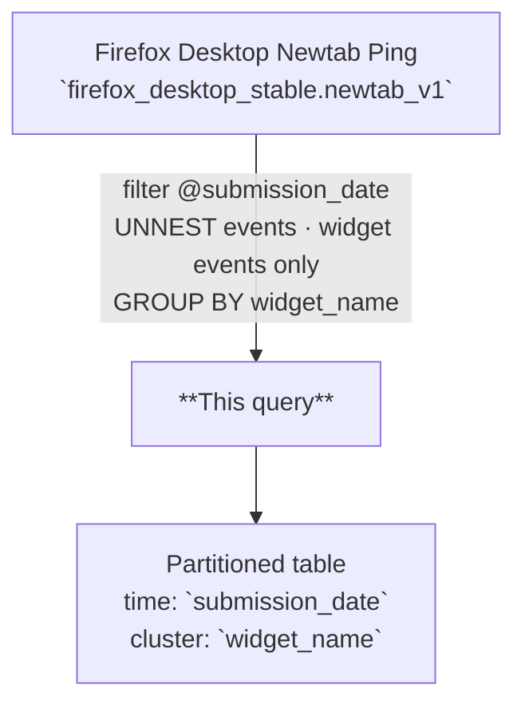

# Newtab Widgets Daily

Daily aggregation of Firefox New Tab widget telemetry at one row per widget per day,
covering impressions, user interactions, enable/disable actions, and engagement metrics
derived from the unified widget telemetry shape in `newtab_v1`.

---

## 📌 Overview

| | |
|---|---|
| **Grain** | One row per `(submission_date, widget_name)` |
| **Source** | `moz-fx-data-shared-prod.firefox_desktop_stable.newtab_v1` |
| **DAG** | `bqetl_newtab` · daily · incremental |
| **Partitioning** | `submission_date` *(partition filter required)* |
| **Clustering** | `widget_name` |
| **Retention** | 775 days |
| **Owner** | gkatre@mozilla.com |
| **Version** | v1 (initial version) |

**Use cases:** widget popularity ranking · engagement vs. impression funnel · enable/disable churn analysis

---

## 🗺️ Data Flow



---

## 🧠 How It Works

1. **Input** — `newtab_v1` has one row per Glean ping; each ping contains a repeated `events` array.
2. **Unnest** — Events are unnested and filtered to widget event types: `widgets_impression`, `widgets_user_event`, and `widgets_enabled`. Rows where `widget_name` is null are excluded.
3. **Aggregation** — Metrics are computed per `(submission_date, widget_name)` using `COUNTIF` for event-level counts and `COUNT(DISTINCT client_id)` for engaged clients.
4. **User action breakdown** — A separate CTE computes per-widget `user_action` counts and aggregates them into a repeated `STRUCT<action, count>` array (`widget_user_action_counts`), ordered by `action`, joined back to the main aggregation.
5. **Data inclusion** — All widget events from the stable table are included; no bot or synthetic client exclusions are applied at this layer.

---

## 🧾 Key Fields

### Dimensions

| Category | Fields |
|---|---|
| Date | `submission_date` |
| Widget | `widget_name` |

### Metrics

| Category | Fields |
|---|---|
| Reach | `widget_impression_count`, `widget_engaged_clients` |
| Enablement | `widget_{enabled\|disabled}_count` |
| Interaction | `widget_user_event_count`, `widget_link_click_count` |
| Feature usage | `widget_{setting_change\|utility_action\|optin_accept}_count` |
| Detail | `widget_user_action_counts` *(repeated `STRUCT<action, count>`)* |

---

## 🧩 Example Queries

```sql
-- 1. Top widgets by impressions over the last 7 days
SELECT
  widget_name,
  SUM(widget_impression_count) AS total_impressions,
  SUM(widget_engaged_clients) AS total_engaged_clients
FROM `moz-fx-data-shared-prod.firefox_desktop_derived.newtab_widgets_daily_v1`
WHERE submission_date >= DATE_SUB(CURRENT_DATE(), INTERVAL 7 DAY)
GROUP BY 1
ORDER BY total_impressions DESC;
```

```sql
-- 2. Enable/disable rate per widget on a given day
SELECT
  widget_name,
  SUM(widget_enabled_count) AS enables,
  SUM(widget_disabled_count) AS disables,
  SAFE_DIVIDE(SUM(widget_disabled_count), SUM(widget_enabled_count)) AS disable_rate
FROM `moz-fx-data-shared-prod.firefox_desktop_derived.newtab_widgets_daily_v1`
WHERE submission_date = DATE_SUB(CURRENT_DATE(), INTERVAL 1 DAY)
GROUP BY 1
ORDER BY disable_rate DESC;
```

```sql
-- 3. Engagement funnel: impressions → interactions → utility actions (last 30 days)
SELECT
  submission_date,
  widget_name,
  SUM(widget_impression_count) AS impressions,
  SUM(widget_user_event_count) AS interactions,
  SUM(widget_utility_action_count) AS utility_actions,
  SAFE_DIVIDE(SUM(widget_user_event_count), SUM(widget_impression_count)) AS interaction_rate,
  SAFE_DIVIDE(SUM(widget_utility_action_count), SUM(widget_user_event_count)) AS utility_rate
FROM `moz-fx-data-shared-prod.firefox_desktop_derived.newtab_widgets_daily_v1`
WHERE submission_date >= DATE_SUB(CURRENT_DATE(), INTERVAL 30 DAY)
GROUP BY 1, 2
ORDER BY 1 DESC, impressions DESC;
```

---

## 🔧 Implementation Notes

- Filtered by `@submission_date`; one partition written per run using `WRITE_TRUNCATE`.
- No deduplication needed — `firefox_desktop_stable.newtab_v1` is already deduplicated at ingestion.
- `widget_user_action_counts` is a repeated `STRUCT<action STRING, count INT64>`; use `UNNEST(widget_user_action_counts)` (or filter on `action = '<name>'` inside the unnest) to get per-action counts in downstream queries.
- `SAFE_DIVIDE` is recommended for all ratio calculations to avoid division-by-zero on widgets with no impressions.
- Widget events with a null `widget_name` extra are excluded from all counts.

---

## 📌 Notes & Conventions

- `widget_engaged_clients` = `COUNT(DISTINCT client_id)` where `event_name IN ('widgets_user_event', 'widgets_enabled')` — excludes passive impression-only clients.
- `widget_enabled_count` / `widget_disabled_count` = count of `widgets_enabled` events split by the `enabled` extra being `'true'` or `'false'`.
- `widget_utility_action_count` covers timer, list, and task actions only; see `query.sql` for the full `user_action` value list.
- `widget_user_action_counts.action` values are `user_action` extras from `widgets_user_event`; the array is NULL if no user events occurred for the widget on that day.

---

## 🗃️ Schema & Related Tables

- Full field definitions: [`schema.yaml`](schema.yaml)
- **Upstream**: `moz-fx-data-shared-prod.firefox_desktop_stable.newtab_v1` — raw Glean newtab pings; source of all widget events
- **Downstream**: intended as a source for Looker explores and DS ad-hoc analysis of widget engagement
