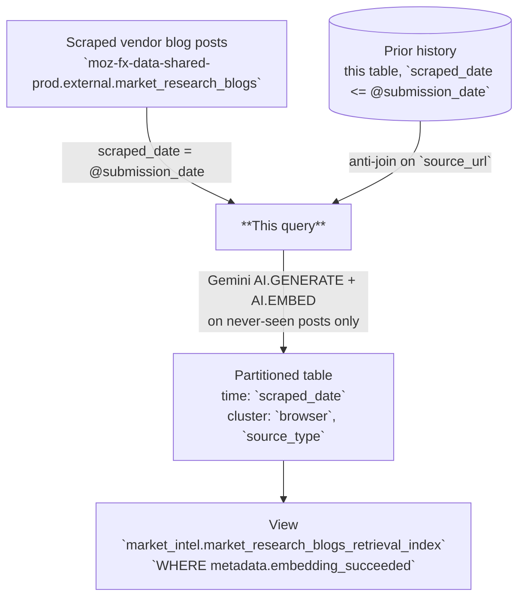

# Market Research Browser Blog Posts Retrieval Index

AI-enriched retrieval table derived from the scraped browser vendor blog corpus, one row per `source_url`. Combines the raw post text with Gemini-generated summaries, classifications, topics, entities, and vector embeddings to support semantic search and grounded question answering over Mozilla's market-intel corpus.

---

## 📌 Overview

| | |
|---|---|
| **Grain** | One row per `source_url` — `scraped_date` is NOT part of the grain |
| **Source** | `moz-fx-data-shared-prod.external.market_research_blogs` |
| **DAG** | `bqetl_market_research` · weekly (`0 15 * * 2`) · incremental |
| **Partitioning** | `scraped_date` *(partition filter required)* |
| **Clustering** | `browser`, `source_type` |
| **Retention** | No automatic expiration |
| **Owner** | lmcfall@mozilla.com |
| **Version** | v1 (initial version) |

**Use cases:** competitor messaging analysis · semantic search via embeddings · narrative/positioning tracking for RAG agents

---

## ⚠️ Analysis Caveats

> Read this section before writing queries. These are the most common sources of incorrect results.

- **`scraped_date` filter is required.** The table enforces a partition filter — omitting it will error.
- **`scraped_date` is a *first-observed* date, not a last-seen date.** The query only enriches `source_url` values it has never indexed, so a post sits permanently on the partition of the scrape that first surfaced it. It is **not** rewritten by later scrapes.
- **Consequence: never filter to a single partition when you want the whole index.** `WHERE scraped_date = X` returns only the posts *first seen* in scrape X. To search the full corpus use an open range, e.g. `WHERE scraped_date >= '2020-01-01'`.
- **`release_date` is the post's publish date, despite the name.** It is inherited from the upstream loader's shared column naming; `scraped_date` is when Mozilla first observed the post.
- **Rows are never re-enriched when upstream text changes.** The identity key is `source_url` and does not include a content hash. If a vendor edits a post already indexed, the edit is not picked up. Changing this would require a v2 with a content-hash component in the identity.
- **`metadata.embedding_succeeded` is the *only* reprocessing driver.** It equals `embedding IS NOT NULL`. LLM-field issues do **not** trigger reruns — they are visible via `failure_reasons` for triage but never gate reprocessing.
- **Filter on individual LLM columns when you need clean values.** `post_summary_llm`, `post_category_llm`, `post_topics_llm`, and `post_entities_llm` can each be NULL or empty independently. If you are aggregating or grouping by one of them, filter `WHERE <col> IS NOT NULL` (and for arrays, `ARRAY_LENGTH(<col>) > 0`).
- **`metadata.failure_reasons` lists every quality check that fired.** Tags: `embedding_missing`, `post_summary_llm_missing`, `post_category_llm_missing`, `post_topics_llm_missing`, `post_topics_llm_has_empty_elements`, `post_entities_llm_missing`, `post_entities_llm_has_empty_elements`. Empty array when all checks pass. Use for model/prompt regression triage; **never** as a reprocessing condition.
- **There is no sentiment field.** Vendor blog posts are marketing/engineering communications, not user-sentiment-bearing content, so this table deliberately omits a sentiment score. Note this also means a post's *tone* is not scored — `post_category_llm` classifies subject matter, not stance.
- **For embedding/retrieval, filter on `embedding IS NOT NULL` (equivalent to `metadata.embedding_succeeded`) at minimum.** This is what the consumer-facing view enforces.
- **Always embed query text with `gemini-embedding-001`.** Mixing embedding models produces mathematically meaningless distances.
- **`browser` is the raw upstream value.** No normalization UDF is applied at read time (none exists for market intel). Expect vendor-specific spellings.
- **`source_type` is always `blog_post`.** It is retained for consistency with the sibling indexes and is not a useful filter here.

---

## 🗺️ Data Flow



---

## 🧠 How It Works

1. **Input** — `raw_new` selects the scrape being processed (`scraped_date = @submission_date`). The upstream loader incrementally appends newly-scraped GCS blobs into a cumulative table, so this is not a clean single-day arrivals feed — the batch can include anything scraped that week, old or new.
2. **History lookup** — `existing_keys` reads this table's own prior partitions (`scraped_date <= @submission_date`) for every `source_url` already indexed.
3. **Dedupe** — `raw_dedup` reduces the scrape to one row per `source_url`, keeping the longest `raw_text` if the same post surfaces in two feeds.
4. **Anti-join** — `new_only` keeps only posts absent from `existing_keys`. This is what makes the pipeline affordable: AI.GENERATE and AI.EMBED run on new posts only.
5. **AI generation** — `AI.GENERATE` with Gemini produces summary, category, topics, and entities per post.
6. **Embedding** — `AI.EMBED` with `gemini-embedding-001` generates a dense vector from concatenated `title` and `raw_text`.
7. **Metadata** — A metadata struct captures model versions, prompt version, input character count, and a validation status flag.

---

## 🧾 Key Fields

### Dimensions

| Category | Fields |
|---|---|
| Date | `scraped_date` (partition, first-observed), `release_date` (vendor publish date) |
| Identity | `source_url` |
| Content | `browser`, `title`, `raw_text`, `source_type`, `blob_name` |
| AI-generated | `post_summary_llm`, `post_category_llm`, `post_topics_llm`, `post_entities_llm` |

### Metrics

| Category | Fields |
|---|---|
| Embedding | `embedding` |
| Pipeline | `metadata.input_char_count`, `metadata.embedding_succeeded` |

---

## 🔍 Working with Embeddings

The `embedding` column is a dense float array produced by `AI.EMBED(CONCAT(title, ' ', raw_text), endpoint => 'gemini-embedding-001')`. Use it to find posts similar to a free-text query, cluster competitor messaging themes, or power grounded QA retrieval.

> **Prerequisites:** running `AI.EMBED` on your own query text requires Vertex AI access and incurs BigQuery ML costs. Contact your data platform team if you hit permission errors.

**Semantic search with `VECTOR_SEARCH`:**

```sql
-- Find the 10 most semantically similar vendor blog posts to a free-text query.
-- Notes:
--  • The partition filter (`scraped_date >=`) MUST live inside the base subquery — the
--    underlying table requires a partition filter, and VECTOR_SEARCH scans `base` before
--    any outer WHERE is applied.
--  • Use a WIDE scraped_date range. scraped_date is first-observed, so a narrow window
--    silently excludes most of the corpus.
--  • The query embedding is passed as a one-row table (subquery aliased to `embedding`)
--    paired with `query_column_to_search => 'embedding'`.
SELECT
  base.browser,
  base.title,
  base.post_summary_llm,
  base.source_url,
  distance
FROM
  VECTOR_SEARCH(
    (
      SELECT *
      FROM `moz-fx-data-shared-prod.market_intel.market_research_blogs_retrieval_index`
      WHERE scraped_date >= '2020-01-01'
    ),
    'embedding',
    (
      SELECT
        AI.EMBED(
          'AI assistant built into the browser sidebar',
          endpoint => 'gemini-embedding-001'
        ).result AS embedding
    ),
    query_column_to_search => 'embedding',
    top_k => 10,
    distance_type => 'COSINE'
  )
ORDER BY distance ASC;
```

**Distance interpretation (cosine distance, lower = more similar):**

| Range | Meaning |
|---|---|
| < 0.3 | Strong match |
| 0.3 – 0.6 | Related |
| > 0.6 | Loosely related |

---

## 🧩 Example Queries

```sql
-- 1. Posting volume and dominant category by vendor
SELECT
  browser,
  post_category_llm,
  COUNT(*) AS post_count
FROM `moz-fx-data-shared-prod.market_intel.market_research_blogs_retrieval_index`
WHERE scraped_date >= '2020-01-01'
  AND release_date >= DATE_SUB(CURRENT_DATE(), INTERVAL 180 DAY)
  AND post_category_llm IS NOT NULL
GROUP BY 1, 2
ORDER BY post_count DESC;
```

```sql
-- 2. What themes are competitors talking about over time?
SELECT
  DATE_TRUNC(release_date, MONTH) AS month,
  topic,
  COUNT(*) AS mentions
FROM `moz-fx-data-shared-prod.market_intel.market_research_blogs_retrieval_index`,
  UNNEST(post_topics_llm) AS topic
WHERE scraped_date >= '2020-01-01'
  AND release_date >= DATE_SUB(CURRENT_DATE(), INTERVAL 365 DAY)
GROUP BY 1, 2
ORDER BY month DESC, mentions DESC;
```

```sql
-- 3. Posts mentioning a specific entity
SELECT
  browser,
  release_date,
  title,
  post_summary_llm,
  source_url
FROM `moz-fx-data-shared-prod.market_intel.market_research_blogs_retrieval_index`
WHERE scraped_date >= '2020-01-01'
  AND 'Manifest V3' IN UNNEST(post_entities_llm)
ORDER BY release_date DESC;
```

```sql
-- 4. Triage: which checks are firing most often?
SELECT
  reason,
  COUNT(*) AS row_count
FROM `moz-fx-data-shared-prod.market_intel_derived.market_research_blogs_retrieval_index_v1`,
  UNNEST(metadata.failure_reasons) AS reason
WHERE scraped_date >= DATE_SUB(CURRENT_DATE(), INTERVAL 90 DAY)
GROUP BY 1
ORDER BY row_count DESC;
```

```sql
-- 5. Operations: rows that need reprocessing (embedding failure only)
SELECT scraped_date, source_url
FROM `moz-fx-data-shared-prod.market_intel_derived.market_research_blogs_retrieval_index_v1`
WHERE scraped_date >= '2020-01-01'
  AND NOT metadata.embedding_succeeded;
```

---

## 🔧 Implementation Notes

- **Scheduled on `bqetl_market_research`.** Same weekly cron (`0 15 * * 2`) as the three upstream loaders. No explicit `depends_on` is needed for task ordering within the DAG — bqetl auto-detects the dependency on the upstream loader task from the tables `query.sql` references (see `references:` in `metadata.yaml`), the same mechanism documented in `docs/reference/scheduling.md`.
- **No `labels:` block yet.** `change_controlled`/`level` are omitted for now — `change_controlled` needs a `CODEOWNERS` entry for `/sql/moz-fx-data-shared-prod/market_intel_derived/**`, and `level: gold` additionally needs unit tests and a Bigeye `bigconfig.yml`. Neither exists yet; add both labels together once they do.
- **Declarative anti-join incremental, not a plain date filter.** A plain `WHERE DATE(created_date) = @submission_date` filter only works when a source is an append-only daily-arrivals feed. This corpus is not: all three market-research loaders incrementally append newly-scraped GCS blobs into a cumulative table. A plain date filter would therefore re-enrich the whole corpus every single week, at full AI.GENERATE + AI.EMBED cost. The anti-join against this table's own history keeps the standard `@submission_date` contract while enriching only posts never seen before.
- **Why `scraped_date <= @submission_date` in the history CTE.** The `<=` predicate satisfies this table's `require_partition_filter: true` while still scanning all prior partitions. A bare `SELECT ... FROM <self>` would be rejected.
- **First run is self-correcting.** On the first-ever run the table exists (schema is deployed before data runs) but is empty, so `existing_keys` returns zero rows and every post in the scrape is treated as new. This is intentional and is not special-cased.
- **NULL-safe identity matching.** `source_url` is a scraped value and can in principle be NULL, so the anti-join coalesces both sides to `''`. Without this a NULL-keyed row would never match its prior-run self and would be re-embedded on every scrape.
- **No join-back after enrichment.** A finer output grain than the distinct-text grain fed to the LLM would force a join back; this table's output grain equals its LLM input grain, so none is needed. The AI CTEs therefore chain directly (`new_only` → `blogs_llm` → `blogs_embedding`) with no join, which also avoids re-introducing the NULL-key hazard on the join back.
- **Not backfill-authored.** No `backfill.yaml` is checked in; one is generated when an actual backfill is initiated via `bqetl query backfill`.

---

## 📋 Change Control

### Prompt version log

| `prompt_version` | Date | Summary |
|---|---|---|
| `v1` | 2026-08-18 | Initial — summary (25 words), category (1–2 words), topics (×5), entities (×5). No sentiment field. |

### When to update

| What changed | Field to update in `query.sql` |
|---|---|
| Prompt text or `output_schema` in `AI.GENERATE` | `prompt_version` — increment to `v2`, `v3`, … |
| Generative model (currently `gemini-2.5-pro`) | `` |
| Embedding model (currently `gemini-embedding-001`) | `` + re-embed full history |

`prompt_version` is stored per row in `metadata.prompt_version`, so rows written under different prompts can be identified and re-processed during backfills. Add a row to this table for every change.

---

## 🗃️ Schema & Related Tables

- Full field definitions: [`schema.yaml`](schema.yaml)
- **Upstream**: `moz-fx-data-shared-prod.external.market_research_blogs` — scraped browser vendor blog posts (view over `external_derived.market_research_blogs_v1`)
- **Downstream**: `moz-fx-data-shared-prod.market_intel.market_research_blogs_retrieval_index` — consumer view, filters to `metadata.embedding_succeeded`
- **Sibling indexes**: `market_research_releases_retrieval_index_v1`, `market_research_jobs_retrieval_index_v1`
