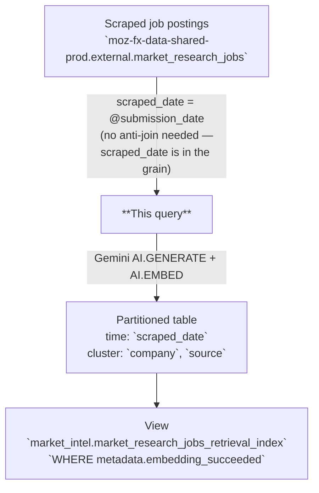

# Market Research Competitor Job Postings Retrieval Index

AI-enriched retrieval table derived from the scraped competitor job-posting corpus, one row per `(company, job_id, scraped_date)`. Combines the raw posting text with Gemini-generated summaries, classifications, topics, entities, and vector embeddings to support semantic search and grounded question answering over Mozilla's market-intel corpus.

---

## 📌 Overview

| | |
|---|---|
| **Grain** | One row per `(company, job_id, scraped_date)` — `scraped_date` **is** part of the grain |
| **Source** | `moz-fx-data-shared-prod.external.market_research_jobs` |
| **DAG** | `bqetl_market_research` · weekly (`0 15 * * 2`) · incremental |
| **Partitioning** | `scraped_date` *(partition filter required)* |
| **Clustering** | `company`, `source` |
| **Retention** | No automatic expiration |
| **Owner** | lmcfall@mozilla.com |
| **Version** | v1 (initial version) |

**Use cases:** competitor hiring-signal analysis · semantic search via embeddings · tracking which product areas rivals are staffing up

---

## ⚠️ Analysis Caveats

> Read this section before writing queries. These are the most common sources of incorrect results.

- **`scraped_date` filter is required.** The table enforces a partition filter — omitting it will error.
- **🚨 A posting appears once per weekly snapshot.** This is the single biggest footgun on this table. The upstream corpus is a full snapshot of currently-open postings, so a job open for ten weeks produces **ten rows**. `COUNT(*)` over a date range counts snapshot-weeks, not jobs. Pick one `scraped_date` (`WHERE scraped_date = '2026-08-11'`) to count open postings at a point in time, or `COUNT(DISTINCT CONCAT(company, job_id))` to count distinct jobs over a window.
- **This differs from the sibling indexes on purpose.** In `market_research_releases_retrieval_index_v1` and `market_research_blogs_retrieval_index_v1`, `scraped_date` is a *first-observed* date and each item appears exactly once ever. Here it is a genuine snapshot date and each item appears repeatedly. Do not carry query habits across the three tables.
- **Because a posting is re-embedded every snapshot, VECTOR_SEARCH over a wide date range returns near-duplicates.** Constrain to a single `scraped_date` for retrieval, or de-duplicate on `(company, job_id)` after the search.
- **`metadata.embedding_succeeded` is the *only* reprocessing driver.** It equals `embedding IS NOT NULL`. LLM-field issues do **not** trigger reruns — they are visible via `failure_reasons` for triage but never gate reprocessing.
- **Filter on individual LLM columns when you need clean values.** `job_summary_llm`, `job_category_llm`, `job_topics_llm`, and `job_entities_llm` can each be NULL or empty independently. If you are aggregating or grouping by one of them, filter `WHERE <col> IS NOT NULL` (and for arrays, `ARRAY_LENGTH(<col>) > 0`).
- **`metadata.failure_reasons` lists every quality check that fired.** Tags: `embedding_missing`, `job_summary_llm_missing`, `job_category_llm_missing`, `job_topics_llm_missing`, `job_topics_llm_has_empty_elements`, `job_entities_llm_missing`, `job_entities_llm_has_empty_elements`. Empty array when all checks pass. Use for model/prompt regression triage; **never** as a reprocessing condition.
- **There is no sentiment field.** Job advertisements are not user-sentiment-bearing content, so this table deliberately omits a sentiment score.
- **`job_id` is not globally unique.** It is source-specific; always pair it with `company`.
- **`first_published` and `updated_at` are STRINGs, not timestamps.** Formats vary by source (Greenhouse vs Teamtailor) and are deliberately left unparsed upstream. Parse defensively with `SAFE.PARSE_TIMESTAMP` if you need them as dates.
- **`description_html` is not embedded.** Only `title` + `description_text` feed the embedding.
- **For embedding/retrieval, filter on `embedding IS NOT NULL` (equivalent to `metadata.embedding_succeeded`) at minimum.** This is what the consumer-facing view enforces.
- **Always embed query text with `gemini-embedding-001`.** Mixing embedding models produces mathematically meaningless distances.

---

## 🗺️ Data Flow



---

## 🧠 How It Works

1. **Input** — `raw_new` selects the snapshot being processed (`scraped_date = @submission_date`).
2. **Dedupe** — `raw_dedup` reduces the snapshot to one row per `(company, job_id, scraped_date)`, keeping the longest `description_text` if a posting is cross-posted.
3. **AI generation** — `AI.GENERATE` with Gemini produces summary, category, topics, and entities per posting.
4. **Embedding** — `AI.EMBED` with `gemini-embedding-001` generates a dense vector from concatenated `title` and `description_text`.
5. **Metadata** — A metadata struct captures model versions, prompt version, input character count, and a validation status flag.
6. **No anti-join** — Unlike the releases and blogs indexes, this query has no self-referencing history lookup. See [Implementation Notes](#-implementation-notes).

---

## 🧾 Key Fields

### Dimensions

| Category | Fields |
|---|---|
| Date | `scraped_date` (partition **and** grain), `first_published`, `updated_at` (both STRING) |
| Identity | `company`, `job_id` |
| Posting | `source`, `title`, `department`, `location`, `offices`, `url` |
| Content | `description_text`, `description_html`, `blob_name` |
| AI-generated | `job_summary_llm`, `job_category_llm`, `job_topics_llm`, `job_entities_llm` |

### Metrics

| Category | Fields |
|---|---|
| Embedding | `embedding` |
| Pipeline | `metadata.input_char_count`, `metadata.embedding_succeeded` |

---

## 🔍 Working with Embeddings

The `embedding` column is a dense float array produced by `AI.EMBED(CONCAT(title, ' ', description_text), endpoint => 'gemini-embedding-001')`. Use it to find postings similar to a free-text query, cluster competitor hiring themes, or power grounded QA retrieval.

> **Prerequisites:** running `AI.EMBED` on your own query text requires Vertex AI access and incurs BigQuery ML costs. Contact your data platform team if you hit permission errors.

**Semantic search with `VECTOR_SEARCH`:**

```sql
-- Find the 10 most semantically similar job postings to a free-text query.
-- Notes:
--  • The partition filter (`scraped_date =`) MUST live inside the base subquery — the
--    underlying table requires a partition filter, and VECTOR_SEARCH scans `base` before
--    any outer WHERE is applied.
--  • Pin to a SINGLE scraped_date. Unlike the releases/blogs indexes, a posting recurs in
--    every snapshot, so a date range would return the same job many times.
--  • The query embedding is passed as a one-row table (subquery aliased to `embedding`)
--    paired with `query_column_to_search => 'embedding'`.
SELECT
  base.company,
  base.title,
  base.job_summary_llm,
  base.location,
  base.url,
  distance
FROM
  VECTOR_SEARCH(
    (
      SELECT *
      FROM `moz-fx-data-shared-prod.market_intel.market_research_jobs_retrieval_index`
      WHERE scraped_date = '2026-08-11'
    ),
    'embedding',
    (
      SELECT
        AI.EMBED(
          'browser rendering engine performance engineer',
          endpoint => 'gemini-embedding-001'
        ).result AS embedding
    ),
    query_column_to_search => 'embedding',
    top_k => 10,
    distance_type => 'COSINE'
  )
ORDER BY distance ASC;
```

**Distance interpretation (cosine distance, lower = more similar):**

| Range | Meaning |
|---|---|
| < 0.3 | Strong match |
| 0.3 – 0.6 | Related |
| > 0.6 | Loosely related |

---

## 🧩 Example Queries

```sql
-- 1. Open postings by company and function, at a point in time.
--    Pin to ONE scraped_date — see the caveat about snapshot repetition.
SELECT
  company,
  job_category_llm,
  COUNT(*) AS open_postings
FROM `moz-fx-data-shared-prod.market_intel.market_research_jobs_retrieval_index`
WHERE scraped_date = '2026-08-11'
  AND job_category_llm IS NOT NULL
GROUP BY 1, 2
ORDER BY open_postings DESC;
```

```sql
-- 2. Hiring trend over time (one count per weekly snapshot)
SELECT
  scraped_date,
  company,
  COUNT(*) AS open_postings
FROM `moz-fx-data-shared-prod.market_intel.market_research_jobs_retrieval_index`
WHERE scraped_date >= DATE_SUB(CURRENT_DATE(), INTERVAL 180 DAY)
GROUP BY 1, 2
ORDER BY scraped_date DESC, open_postings DESC;
```

```sql
-- 3. Distinct jobs mentioning a technology over a window
--    (COUNT DISTINCT because a posting recurs across snapshots)
SELECT
  company,
  COUNT(DISTINCT CONCAT(company, '|', job_id)) AS distinct_jobs
FROM `moz-fx-data-shared-prod.market_intel.market_research_jobs_retrieval_index`,
  UNNEST(job_entities_llm) AS entity
WHERE scraped_date >= DATE_SUB(CURRENT_DATE(), INTERVAL 365 DAY)
  AND entity = 'Rust'
GROUP BY 1
ORDER BY distinct_jobs DESC;
```

```sql
-- 4. Triage: which checks are firing most often?
SELECT
  reason,
  COUNT(*) AS row_count
FROM `moz-fx-data-shared-prod.market_intel_derived.market_research_jobs_retrieval_index_v1`,
  UNNEST(metadata.failure_reasons) AS reason
WHERE scraped_date >= DATE_SUB(CURRENT_DATE(), INTERVAL 90 DAY)
GROUP BY 1
ORDER BY row_count DESC;
```

```sql
-- 5. Operations: rows that need reprocessing (embedding failure only)
SELECT scraped_date, company, job_id
FROM `moz-fx-data-shared-prod.market_intel_derived.market_research_jobs_retrieval_index_v1`
WHERE scraped_date >= DATE_SUB(CURRENT_DATE(), INTERVAL 90 DAY)
  AND NOT metadata.embedding_succeeded;
```

---

## 🔧 Implementation Notes

- **Scheduled on `bqetl_market_research`.** Same weekly cron (`0 15 * * 2`) as the three upstream loaders. No explicit `depends_on` is needed for task ordering within the DAG — bqetl auto-detects the dependency on the upstream loader task from the tables `query.sql` references (see `references:` in `metadata.yaml`), the same mechanism documented in `docs/reference/scheduling.md`.
- **No `labels:` block yet.** `change_controlled`/`level` are omitted for now — `change_controlled` needs a `CODEOWNERS` entry for `/sql/moz-fx-data-shared-prod/market_intel_derived/**`, and `level: gold` additionally needs unit tests and a Bigeye `bigconfig.yml`. Neither exists yet; add both labels together once they do.
- **No anti-join here, deliberately.** The sibling releases and blogs indexes anti-join against their own history because their grain excludes `scraped_date`, so re-processing an unchanged item would duplicate it. Here `scraped_date` is *in* the grain: a posting that stays open is *supposed* to be indexed once per snapshot, because the snapshot series is itself the hiring signal. Filtering raw to `scraped_date = @submission_date` and WRITE_TRUNCATE-ing that one partition is therefore already correct and non-duplicating, and an anti-join would wrongly suppress the repeat observations. This query keeps a simple shape: dedupe → AI.GENERATE → AI.EMBED → final SELECT.
- **Cost consequence.** Because there is no anti-join, this table re-embeds every open posting every week. That is intentional given the grain, but it makes this the most expensive of the three indexes to run. If cost becomes a problem, the fix is a v2 that stores one row per `(company, job_id)` with a first/last-seen date range, not an anti-join bolted onto v1.
- **Clustering leads with `company`** (then `source`), mirroring the upstream loader's reasoning that snapshot-aware queries filter by company within a chosen partition.
- **Not backfill-authored.** No `backfill.yaml` is checked in; one is generated when an actual backfill is initiated via `bqetl query backfill`.

---

## 📋 Change Control

### Prompt version log

| `prompt_version` | Date | Summary |
|---|---|---|
| `v1` | 2026-08-18 | Initial — summary (25 words), category (1–2 words), topics (×5), entities (×5). No sentiment field. |

### When to update

| What changed | Field to update in `query.sql` |
|---|---|
| Prompt text or `output_schema` in `AI.GENERATE` | `prompt_version` — increment to `v2`, `v3`, … |
| Generative model (currently `gemini-2.5-pro`) | `` |
| Embedding model (currently `gemini-embedding-001`) | `` + re-embed full history |

`prompt_version` is stored per row in `metadata.prompt_version`, so rows written under different prompts can be identified and re-processed during backfills. Add a row to this table for every change.

---

## 🗃️ Schema & Related Tables

- Full field definitions: [`schema.yaml`](schema.yaml)
- **Upstream**: `moz-fx-data-shared-prod.external.market_research_jobs` — scraped competitor job postings (view over `external_derived.market_research_jobs_v1`)
- **Downstream**: `moz-fx-data-shared-prod.market_intel.market_research_jobs_retrieval_index` — consumer view, filters to `metadata.embedding_succeeded`
- **Sibling indexes**: `market_research_releases_retrieval_index_v1`, `market_research_blogs_retrieval_index_v1`
