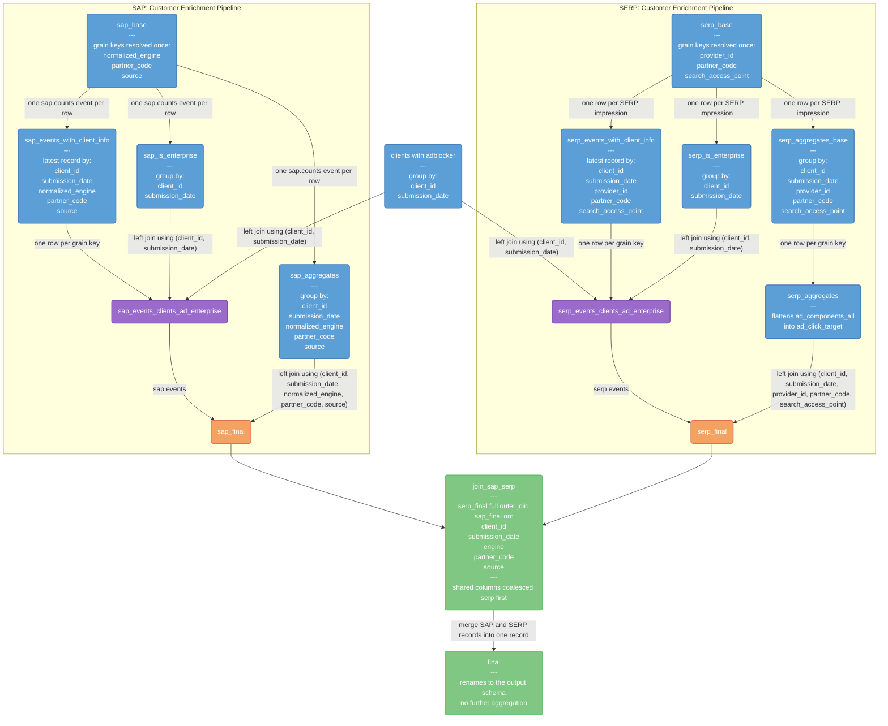

[DENG-8178 for search_clients_daily_v9](https://mozilla-hub.atlassian.net/browse/DENG-8178)

A daily aggregate of desktop searches, one row per `client_id`, `submission_date`, `normalized_engine`, `partner_code` and `source`.

Exposed to users as view `search.search_clients_engines_sources_daily`.

This is the Glean-based replacement for the legacy `search_clients_daily_v8`.

## Helper functions

One temporary function turns the string timestamps that Glean emits into dates.

- `local_date_of` returns the date portion of a client-local timestamp string, `substr(ts, 1, 10)` parsed as `%F`. It is applied to `client_info.first_run_date` and `first_run_date`, to the SAP `ping_info.start_time`, and to the SERP `subsession_start_time`.

Every one of those values is written on the client's own calendar with a trailing offset, so the date is what the client's clock said and nothing needs converting. That matters most for `profile_age_in_days`, which subtracts a first run date from an activity date: read one of them in UTC and the subtraction compares two different frames, which puts a client who installed today at an age of -1 for no reason.

The SAP side reads `ping_info.start_time` rather than the `ping_info.parsed_start_time` sitting beside it. Glean ships both, and they differ in type, not in meaning:

| column              | type        | example                         |
| ------------------- | ----------- | ------------------------------- |
| `start_time`        | `STRING`    | `2026-08-13T09:30:18.000+03:00` |
| `parsed_start_time` | `TIMESTAMP` | `2026-08-13 06:30:18 UTC`       |

They are the same moment. But a `TIMESTAMP` is an absolute instant carrying no timezone, so `date()` of one is always a UTC date and there is no way to recover the client's local date from it — `date(ts, tz)` would need a timezone name, and the row has only a numeric offset, inside the string. Only `start_time` still holds the offset, which is why the local date has to be read from it. The two dates disagree on 9.4% of events.

Parsing no time component also means variable precision costs nothing. `subsession_start_time` arrives in four shapes, two of which have no seconds — `2026-08-12T17:10+05:30` — and a pattern written for the other two returns null on them silently.

## Tables (CTEs)

### Adblocker

These are the `_adblocker_addons` CTEs. The grain is **one row per `client_id` per `submission_date`**. Each row represents whether a specific client had at least one active ad-blocking add-on on a specific day. So if a client had multiple active ad-blocking add-ons on the same day, they would still only get one row in this result set with `has_adblocker_addon = true`.

Comes from `moz-fx-data-shared-prod.revenue.monetization_blocking_addons` and `moz-fx-data-shared-prod.firefox_desktop_stable.metrics_v1`

The CTE:

- unnests the `metrics.object.addons_active_addons` array to examine each addon
- `inner join`s with the list of known ad-blocking add-ons
- filters to only include addons that are enabled (not user-disabled, app-disabled, or blocklisted)
- sets `has_adblocker_addon` to `true` if any matching ad blocker is found
- groups by `client_id` and `date(submission_timestamp)` (aliased as `submission_date`)

Because the join onto the SAP and SERP pipelines is a `left join`, a client that never appears here would otherwise be `null`. Both enrichment CTEs wrap the column in `coalesce(..., false)` so a client with no ad blocker reports a confident `false`, matching v8.

### Enterprise

These are the `_is_enterprise_cte`s. The grain is **one row per `client_id` and `submission_date`**. Each row represents a specific client's enterprise policy status for a specific day, taken as the statistical mode (most common value) across that day's events. **Note:** If a client had multiple events on the same day, they would still only get one row in this result set, showing the mode of their enterprise status for that day (ties broken toward the latest `event_timestamp`). This matches v8.

Both CTEs require `document_id is not null`, and the SAP one additionally restricts to `event = 'sap.counts'`.

#### Aggregation

- collects all `policies_is_enterprise` values for that client-date combination (`array_agg()` with `order by event_timestamp` ascending)
- takes the statistical mode as the enterprise policy status (`mozfun.stats.mode_last()`, ties broken toward the latest event), matching v8's `mode_last` behavior

#### Grouping

- groups by `client_id` and `date(submission_timestamp)` (aliased as `submission_date`)

### SAP and SERP CTEs

SAP's comes from `moz-fx-data-shared-prod.firefox_desktop_derived.events_stream_v1`, read by `sap_base` and restricted there to `event = 'sap.counts'`. Its client and metric columns are read out of JSON with `json_value` and `json_extract_scalar`.

`sap_base` resolves the three grain keys once, and also `browser_version_info` — a `select` cannot reference an alias from its own list, so computing the struct there is what lets `sap_events_with_client_info` read four fields off one value instead of calling `mozfun.norm.browser_version_info` once per field. That matches the SERP side, where `serp_events_v2` already stores the struct under the same name. Nothing is excluded from the passthrough, because `events_stream_v1` carries none of the seven names `sap_base` adds.

SERP's comes from `mozdata.firefox_desktop.serp_events`, read by `serp_base`, which every other SERP CTE reads in turn. The `mozdata` view rather than `serp_events_v2` because `serp_events_v2` does not carry the aggregated fields such as `num_ads_visible`; the view adds those and drops only `engagements` and `component_impressions`, so it is a superset of what any SERP CTE needs.

`serp_base` resolves the three grain keys once and passes the rest of the row through with `select * except (glean_client_id, partner_code, sap_source)`. The excluded set is the raw form of each resolved key, dropped so that no consumer can key on it by accident — which would produce exactly the silent join miss this CTE exists to prevent. `partner_code` would have to go regardless, since the derived column reuses the source name and leaving both makes every downstream reference ambiguous; BigQuery enforces that one case, and the other two are the same hazard hidden only by the names differing. `search_engine` stays, because `normalize_search_engine` collapses many raw strings into buckets, making the raw engine a different fact rather than the same fact in another spelling. Every SERP CTE after the base then selects the keys as plain columns, which is what makes them impossible to drift apart.

The engine is normalized on both sides through `udf.normalize_search_engine`. On the SAP side the input is `provider_id`, except where `provider_id` is `other`, in which case `provider_name` is normalized instead. On the SERP side the input is `search_engine`.

`sap_base` also projects those two raw extras as `sap_provider_id` and `sap_provider_name`, and they reach the output under those names, so a consumer can see what the engine `case` collapsed — in particular which provider an `other` row actually was. They are prefixed at `sap_base` rather than at the join, which is the one departure from the prefix convention described below: by `join_sap_serp_cte` the name `provider_id` already means the SERP normalized engine, so an unprefixed SAP `provider_id` would collide with it. There is no SERP counterpart to coalesce with, because SERP carries a single provider extra that `serp_base` normalizes into `provider_id` and does not keep raw.

`partner_code` is a grain key, so two searches on the same engine and source with different partner codes on the same day produce two rows, one per code. It is never `null`: both sides derive it as `coalesce(nullif(partner_code, ''), 'no_code')`, so an empty string and an absent key both become the literal `no_code`. This is required rather than cosmetic — `partner_code` is a key in all three internal joins, and BigQuery's equality never matches `null` to `null`, so a nullable key would silently lose every affected row's aggregates. It also means consumers can split on `partner_code` with `=` and `!=` without a `null` bucket escaping both sides. The expression appears twice, once in `sap_base` and once in `serp_base`, and the two must stay byte-identical or the join misses.

SAP `source` values are rewritten onto the SERP vocabulary, which the SERP side reads from `sap_source`. `abouthome` becomes `about_home`, `newtab` becomes `about_newtab`, and every remaining hyphen becomes an underscore, so `urlbar-handoff`, `urlbar-searchmode` and `urlbar-persisted` become `urlbar_handoff`, `urlbar_searchmode` and `urlbar_persisted`. A `null` source stays `null`. The expression appears once, in `sap_base`.

The SERP side lowercases `sap_source`. `serp_events` emits one mixed-case value, `follow_on_from_refine_on_SERP`, in an otherwise entirely lowercase vocabulary, and this column is both a grain key and the output `source` column. Left raw it would be a silent-empty-result trap: a consumer filtering `source = 'follow_on_from_refine_on_serp'` would match nothing, with no error and no hint. Lowering has no effect on the join — the SAP side has no lowercase counterpart for that value, so the row is SERP-only either way, which is correct, since a follow-on search is issued from the results page rather than a browser search access point. The `lower()` appears once, in `serp_base`.

#### Events with client info

These are the `_events_with_client_info` CTEs. The grain is **one row per `client_id`, `submission_date`, engine, `partner_code` and access point** — `normalized_engine` and `source` on the SAP side, `provider_id` and `search_access_point` on the SERP side.

Each row represents the most recent search event for a specific client, on a specific day, using a specific search engine, with a specific partner code, from a specific source. Every other column is a passthrough from that one surviving event.

**Note:** If a client performed multiple searches on the same day with the same engine, partner code and source combination, they would still only get one row in this result set, showing the details from their most recent search event (based on the latest `event_timestamp`).

##### Qualify

- partitions events by `client_id`, `submission_date`, engine, `partner_code` and access point (`row_number()`)
- lists the most recent event first (`order by event_timestamp desc`)
- on the SERP side adds `impression_id` as a secondary sort key so ties are broken deterministically
- keeps only the most recent event (`qualify row_number() = 1`)

#### Events with client, ad blocker and enterprise info

- `_events_with_client_info`
- `left join`ed to `adblocker_addons`, with `has_adblocker_addon` wrapped in `coalesce(..., false)`
- `left join`ed to `is_enterprise_cte`
- using `client_id, submission_date`

#### Aggregates

These are the `_aggregates` CTEs. The grain is **one row per `client_id`, `submission_date`, engine, `partner_code` and access point** — the same keys the corresponding `_events_with_client_info` CTE partitions by.

The SERP side is split in two. `serp_aggregates_base` does the grouping and carries `ad_components_all`, the group's `ad_components` arrays concatenated with `array_concat_agg`. `serp_aggregates` reads that CTE — not `serp_events`, so there is no second scan of the source — and flattens the array into `ad_click_target`, a comma-separated string of the distinct ad components the client clicked, ordered so the concatenation is deterministic (`string_agg(distinct ... order by ...)`). A key whose `ad_components` are all empty concatenates to an empty array, which unnests to no rows and leaves `ad_click_target` null.

The split exists because the flatten and the aggregation cannot share a query level: BigQuery rejects an aggregate inside `unnest`, so `array_concat_agg` has to land as a column before anything unnests it. Concatenating arrays is what makes this safe to compute alongside the counts — a `cross join unnest(ad_components)` in the same CTE would multiply rows and corrupt `count(*)` and every `sum`.

Each row represents aggregated search activity and engagement metrics for a specific client, on a specific day, using a specific search engine, with a specific partner code, from a specific source.

**Note:** If a client performed multiple searches on the same day with the same engine, partner code and source combination, they would get one row in this result set with all their activity aggregated together.

The two sides do not compute the same measures.

- SAP produces `sap_counts_total` (a count of `sap.counts` events) and `concurrent_tab_count_max`, and derives `profile_age_in_days` from `ping_info.start_time` against the first run date.
- SERP produces `serp_counts_total` and the ad measures: tagged and organic search counts, searches with ads, ad clicks, and the `num_ads_*` family. Tagged and organic are split on `is_tagged`, and follow-on searches are those whose `search_access_point` is `follow_on_from_refine_on_incontent_search` or `follow_on_from_refine_on_serp`. SERP derives `profile_age_in_days` from `subsession_start_time` against the first run date.

#### SAP and SERP Final

- `_events_clients_ad_enterprise`
- `left join`ed to `_aggregates`

SAP joins using `client_id, submission_date, normalized_engine, partner_code, source`. SERP joins using `client_id, submission_date, provider_id, partner_code, search_access_point`.

### Join SAP and SERP

This is the `join_sap_serp_cte`. The grain is **one row per `client_id`, `submission_date`, engine, `partner_code` and access point**, carrying both the SAP and the SERP measures for that combination.

#### Full outer join, not serp-driven

The two pipelines are combined with a `full outer join`, so a row survives if it appears on either side.

- A search access point with no matching SERP impression keeps its `sap_counts_total` value. Driving the join from SERP alone would drop that activity entirely, since the SAP `source` and SERP `sap_source` vocabularies only partly overlap.
- A SERP impression with no matching SAP event keeps its ad and engagement measures.
- Two SERP-only columns are `null` on a sap-only row: `ad_click_target` and `ad_blocker_inferred`. Every other SERP-only measure is a count and falls back to `0`. `os_version_major` and `os_version_minor` used to be `null` here too; both pipelines now derive them, so they are coalesced like the other operating system columns.
- Two SAP-only columns are `null` on a serp-only row: `sap_provider_id` and `sap_provider_name`. They are strings rather than counts, so there is nothing to zero-fill, and the SERP side has no raw provider extra to fall back to.

#### Column precedence

Every column present on both sides is combined with `coalesce(serp, sap)`. SERP takes precedence and SAP fills in only where the SERP value is `null`. `experiments` is the one exception: SERP arrives as a repeated field and is never `null`, so an empty SERP array would always beat a populated SAP one. It is wrapped in `if(array_length(...) = 0, null, ...)` first, which makes the precedence "whichever side recorded enrollments" rather than "whichever side exists". This applies to the join keys, to the client dimensions such as `country`, `locale` and the operating system columns, to the default and private search engine columns, and to the two shared measures, `profile_age_in_days` and `max_concurrent_tab_count_max`.

The prefix on a column name says which side it can come from. A coalesced column has no prefix. A `serp_` or `sap_` prefix that survives into this CTE means the value exists on that side only — `sap_counts_total`, `sap_provider_id` and `sap_provider_name` from SAP, and `serp_counts_total`, `serp_ad_click_target`, `serp_ad_blocker_inferred` and the SERP ad and engagement counts from SERP.

Most prefixes are applied here, at the join, and the side-only column is coined unprefixed upstream. `sap_provider_id` and `sap_provider_name` are the exception: they carry the prefix from `sap_base` onward, because `provider_id` is already taken by the SERP normalized engine in this CTE and the unprefixed pair would collide with it.

**Coalescing the join keys is load-bearing, not cosmetic.** The final CTE reads every identity column from the SERP side, so without the `coalesce` a sap-only row would emit a `null` `submission_date`, `client_id`, `source`, `country` and `sample_id`. `submission_date` is the fatal one: the table is day-partitioned on it with `require_partition_filter: true`, so those rows would land in the `__NULL__` partition and be unreachable to any query that filters by date — which is every query. `sample_id` matters too, since it is the clustering field.

#### Counts and sums are zero, never null

Every count and sum in this CTE falls back to `0`. A row that reaches this CTE from one side only has no counterpart on the other side for that client, date, engine, partner code and access point, so zero is the count rather than an unknown.

The trade-off is that a zero no longer distinguishes "no activity" from "the other side's data is missing or late". Conditions where SAP is recorded but not SERP are mostly on engines where we have not instrumented SERP metrics at all. If needed, look at the search provider to check uncertainty.

- `max_concurrent_tab_count_max`, the one shared measure that zero-fills, takes a third `coalesce` argument.
- `sap_counts_total` is zero on a serp-only row.
- The fifteen SERP-only counts are zero on a sap-only row: `serp_counts_total`, the tagged, organic and follow-on search counts, the searches-with-ads and ad-click counts, and the six `num_*` measures.

Five columns are deliberately left alone. `profile_age_in_days` is not a count, and a zero would read as a profile created that day rather than as a missing value. `ad_click_target` is a string and `ad_blocker_inferred` is a boolean, so neither has a meaningful zero. `sap_provider_id` and `sap_provider_name` are strings for the same reason, and are the only two of the five that are `null` on a serp-only row rather than a sap-only one.

#### Two constraints worth knowing before editing this CTE

- **The join keys cannot use `is not distinct from`.** BigQuery requires at least one literal `=` in a `full outer join` ON clause, so each nullable key is spelled out as an equality plus an explicit both-`null` match. `partner_code` is the exception: it is never `null`, so a plain `=` is enough.
- **One `coalesce` needs an explicit cast.** `sap_aggregates_cte` casts its integer counter to `float64`, so combining it with the SERP side would widen the result and break the `INTEGER` type declared in `schema.yaml`. `max_concurrent_tab_count_max` therefore casts the SAP side back to `int64` inside the `coalesce`.

### Final

This is `final_cte`. It renames the joined columns to the output schema and performs no further aggregation or filtering, so the row count matches `join_sap_serp_cte` exactly. There is no `where` clause, which is what allows SAP-only rows to reach the table.

A few output columns are worth calling out.

- `normalized_engine` is the only engine column. v8's `engine` is dropped. In v8 `engine` held the raw engine string and `normalized_engine` was always null; in v9 the engine is normalized through `udf.normalize_search_engine` on both pipelines, so the two columns would have held the same value.
- `sap_provider_id` and `sap_provider_name` are the raw SAP extras behind `normalized_engine`, kept so the normalization is auditable — `normalized_engine` buckets many raw providers into one value, and where `sap_provider_id` is `other` it is `sap_provider_name` that determined the bucket. Both keep their prefix in the output and are `null` on serp-only rows. They have no v8 counterpart.
- `tagged_serp` is the only tagged count. v8's `tagged_sap` is dropped: SAP has no `is_tagged`, so v9 had no independent SAP-side measure to put there and both columns would have carried the same `serp_searches_tagged_count` value.
- The ad measures are renamed so each name states which half it counts, rather than leaving the tagged half as the unmarked default the way v8 did. v8's `ad_click` is `ad_click_total`, `ad_clicks_tagged` is `ad_click_tagged`, and `search_with_ads` is `search_with_ads_tagged`. The organic counterparts, `ad_click_organic` and `search_with_ads_organic`, keep their v8 names. So the tagged and organic pairs now read `ad_click_tagged`/`ad_click_organic` and `search_with_ads_tagged`/`search_with_ads_organic`, with `ad_click_total` counting every ad click regardless of `is_tagged`. Note that `ad_click_total` is not guaranteed to equal `ad_click_tagged` plus `ad_click_organic`: the two halves are split on `is_tagged is true` and `is_tagged is false`, both of which exclude `null`, while the total sums every row. They agree only where `is_tagged` is never `null`.
- `experiments` prefers the SERP passthrough, which arrives as a repeated field and is never `null`. Because `coalesce` returns the first non-`null` argument and an empty array is not `null`, the SAP side is only reached on sap-only rows. The SAP side builds the same shape from JSON, one element per enrollment, ordered by experiment slug.

v9 is **not** a column-for-column match of v8 and is not intended to be. Every column carries real data; nothing is emitted as a placeholder `null` purely to preserve the v8 shape. Nineteen v8 columns that had no Glean source are therefore absent from both the query and `schema.yaml`: `addon_version`, `search_cohort`, `subsessions_hours_sum`, `active_addons_count_mean`, `unknown`, `is_sap_monetizable`, and the thirteen `scalar_parent_urlbar_searchmode_*` columns.

## Determinism and reproducibility

One output carries a tie that BigQuery does not break. It matches `search_clients_daily_v8` and is left unchanged.

- `policies_is_enterprise` (the `_is_enterprise_cte`s): `mozfun.stats.mode_last(array_agg(... order by event_timestamp))` takes the statistical mode, breaking ties toward the latest event. On two mode-tied values whose events share the same `event_timestamp` the tiebreak is arbitrary. v8 is the same: `mozfun.stats.mode_last(array_agg(... order by submission_timestamp))`, no secondary tiebreaker.

Four outputs were non-deterministic and have been made reproducible:

- `ad_click_target` (`string_agg`): `order by ad_component.component`. `distinct` fixes the set; the `order by` fixes the concatenation order.
- `experiments` on the SAP side (`sap_events_with_client_info_cte`): the array is built by iterating `json_keys(experiments, 1)`, whose order BigQuery does not document as stable, so the element order is pinned with `order by k` on the experiment slug. The SERP side is a passthrough of `ping_info.experiments` and keeps whatever order the ping carried; the two conventions never mix, because the `coalesce` in `join_sap_serp_cte` takes one side's array whole.
- SERP passthrough columns (`serp_events_with_client_info_cte`): the `qualify row_number() over (... order by event_timestamp desc)` picked an arbitrary row when two events for the same client, date, engine, and access point shared an `event_timestamp`. `impression_id` is now a secondary sort key; it is unique in `serp_events_v2`, so the surviving row is fully determined.
- SAP passthrough columns (`sap_events_with_client_info_cte`): the same problem, and the exact mirror of the case above. `event_timestamp` on `events_stream_v1` is itself derived — it prefers a `glean_timestamp` extra and otherwise falls back to `ping_info.parsed_start_time` plus the event's millisecond offset — so two `sap.counts` events in one ping tie whenever they land in the same millisecond. `event_id` is now a secondary sort key; it is `document_id` plus the event's position in the ping, so it is unique per event and the surviving row is fully determined.
