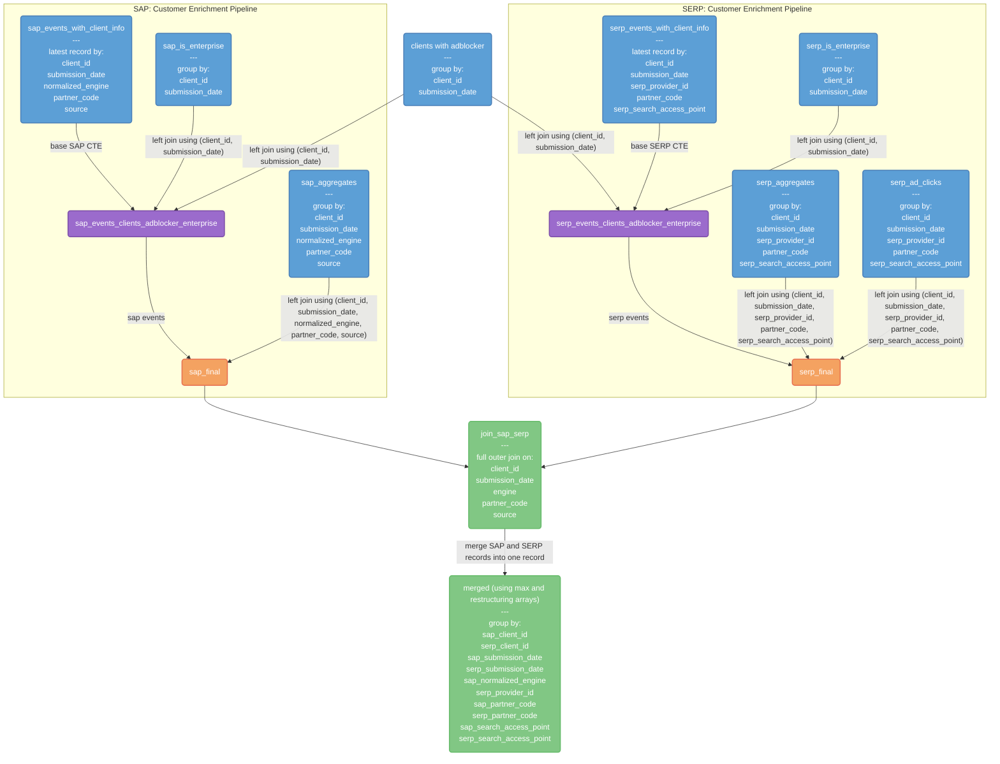

[DENG-8178 for search_clients_daily_v9](https://mozilla-hub.atlassian.net/browse/DENG-8178)

A daily aggregate of desktop searches per (client_id, engine, source).

Exposed to users as view `search.search_clients_engines_sources_daily`.

## Tables (CTEs)

### Adblocker

These are the `_adblocker_addons` CTEs. The grain is **one row per `client_id` per `submission_date`**. Each row represents whether a specific client had at least one active ad-blocking add-on on a specific day. So if a client had multiple active ad-blocking add-ons on the same day, they would still only get one row in this result set with `has_adblocker_addon = true`.

Comes from `moz-fx-data-shared-prod.revenue.monetization_blocking_addons` and `moz-fx-data-shared-prod.firefox_desktop_stable.metrics_v1`

The CTE:

- unnests the `metrics.object.addons_active_addons` array to examine each addon
- `inner join`s with the list of known ad-blocking add-ons
- filters to only include addons that are enabled (not user-disabled, app-disabled, or blocklisted)
- sets `has_adblocker_addon` to `true` if any matching ad blocker is found
- groups by `client_id` and `date(submission_timestamp)` (aliased as `submission_date`)

### Enterprise

These are the `_is_enterprise_cte`s. The grain is **one row per `client_id` and `submission_date`**. Each row represents a specific client's most recent enterprise policy status for a specific day. **Note:** If a client had multiple events on the same day, they would still only get one row in this result set, showing their most recent enterprise status for that day (based on the latest `event_timestamp`).

#### Aggregation

- collects all `policies_is_enterprise` values for that client-date combination (`array_agg()` with `order by event_timestamp desc`)
- gets the **most recent** enterprise policy status (`array_last()`) as a `boolean`

#### Grouping

- groups by `client_id` and `date(submission_timestamp)` (aliased as `submission_date`)

### SAP and SERP CTEs

SAP's comes from `moz-fx-data-shared-prod.firefox_desktop_derived.events_stream_v1`

SERP's comes from `moz-fx-data-shared-prod.firefox_desktop_derived.serp_events_v2` and `mozdata.firefox_desktop.serp_events`

#### Events with client info

These are the `_events_with_client_info` CTEs. The grain is **one row per `client_id`, `submission_date`, `normalized_engine`, `partner_code` and `source`**.

Each row represents the most recent search event for a specific client, on a specific day, using a specific search engine, with a specific partner code, from a specific source.

**Note:** If a client performed multiple searches on the same day with the same engine, partner code, and source combination, they would still only get one row in this result set, showing the details from their most recent search event (based on the latest `event_timestamp`).

##### Qualify

- partitions events by `client_id`, `submission_date`, `normalized_engine`, `partner_code`, and `source` (`row_number()`)
- lists the most recent event first (`order by event_timestamp desc`)
- keeps only the most recent event (`qualify row_number() = 1`)

#### Events with client, ad blocker and enterprise info

- `_events_with_client_info`
- `left join`ed to `adblocker_addons`
- `left join`ed to `is_enterprise_cte`
- using `client_id, submission_date`

#### SERP Ad Click Targets

This is the SERP `ad_click_target` CTE. The grain is **one row per `client_id`, `submission_date`, `serp_provider_id`, `partner_code` and `serp_search_access_point`**.

Each row represents a concatenated list of distinct ad components that a specific client clicked on, for a specific day, on a specific search engine, with a specific partner code, from a specific search access point.

**Note:** If a client clicked on multiple ads (or the same ad multiple times) on the same day with the same engine, partner code, and search access point combination, they would get one row in this result set with all their distinct ad components listed as a comma-separated string.

- accesses individual ad component records (`unnest(ad_components)`)
- collect all unique ad component values clicked and concatenates them into a single comma-separated string  (`string_agg(distinct ...)`)

#### Aggregates

These are the `_aggregates` CTEs. The grain is **one row per `client_id`, `submission_date`, `normalized_engine`, `partner_code` and `source`**.

Each row represents aggregated search activity and engagement metrics for a specific client, on a specific day, using a specific search engine, with a specific partner code, from a specific source.

**Note:** If a client performed multiple searches on the same day with the same engine, partner code, and source combination, they would get one row in this result set with all their activity aggregated together.

#### SAP and SERP Final

Using `client_id, submission_date, normalized_engine, partner_code, source`:

- `_events_clients_ad_enterprise`
- `left join`ed to `serp_ad_click_target`
- `left join`ed to `_aggregates`

### Join SAP and SERP

### Consolidate SAP and SERP

### Final
