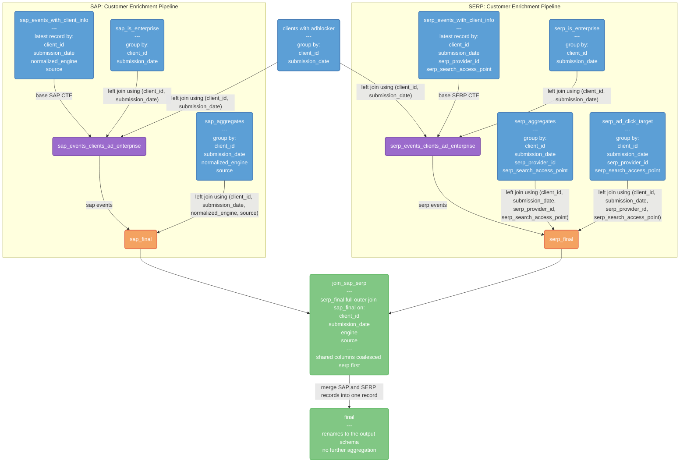

[DENG-8178 for search_clients_daily_v9](https://mozilla-hub.atlassian.net/browse/DENG-8178)

A daily aggregate of desktop searches, one row per `client_id`, `submission_date`, `engine` and `source`.

Exposed to users as view `search.search_clients_engines_sources_daily`.

This is the Glean-based replacement for the legacy `search_clients_daily_v8`.

```mermaid
graph TD
    %% OTHER
    adblocker("clients with adblocker<br/>---<br/>group by:<br/>client_id<br/>submission_date")

    %% SAP
    subgraph SG1["SAP: Customer Enrichment Pipeline"]
    base_sap("sap_events_with_client_info<br/>---<br/>latest record by:<br/>client_id<br/>submission_date<br/>normalized_engine<br/>source")

    sap_enterprise("sap_is_enterprise<br/>---<br/>group by:<br/>client_id<br/>submission_date")

    sap_full_events("sap_events_clients_ad_enterprise")

    sap_agg("sap_aggregates<br/>---<br/>group by:<br/>client_id<br/>submission_date<br/>normalized_engine<br/>source")

    sap_final("sap_final")

    base_sap -->|"base SAP CTE"| sap_full_events

    sap_enterprise -->|"left join using (client_id, submission_date)"| sap_full_events

    sap_full_events -->|"sap events"| sap_final

    sap_agg -->|"left join using (client_id, submission_date, normalized_engine, source)"| sap_final
    end

    adblocker -->|"left join using (client_id, submission_date)"| sap_full_events
    adblocker -->|"left join using (client_id, submission_date)"| serp_full_events

    %% SERP
    subgraph SG2["SERP: Customer Enrichment Pipeline"]
    base_serp("serp_events_with_client_info<br/>---<br/>latest record by:<br/>client_id<br/>submission_date<br/>serp_provider_id<br/>serp_search_access_point")

    serp_enterprise("serp_is_enterprise<br/>---<br/>group by:<br/>client_id<br/>submission_date")

    serp_full_events("serp_events_clients_ad_enterprise")

    serp_agg("serp_aggregates<br/>---<br/>group by:<br/>client_id<br/>submission_date<br/>serp_provider_id<br/>serp_search_access_point")

    serp_ad_click("serp_ad_click_target<br/>---<br/>group by:<br/>client_id<br/>submission_date<br/>serp_provider_id<br/>serp_search_access_point")

    serp_final("serp_final")

    base_serp -->|"base SERP CTE"| serp_full_events

    serp_enterprise -->|"left join using (client_id, submission_date)"| serp_full_events

    serp_full_events -->|"serp events"| serp_final

    serp_agg -->|"left join using (client_id, submission_date, serp_provider_id, serp_search_access_point)"| serp_final

    serp_ad_click -->|"left join using (client_id, submission_date, serp_provider_id, serp_search_access_point)"| serp_final
    end

    %% FINALS

    join_sap_serp("join_sap_serp<br/>---<br/>serp_final full outer join sap_final on:<br/>client_id<br/>submission_date<br/>engine<br/>source<br/>---<br/>shared columns coalesced serp first")

    final("final<br/>---<br/>renames to the output schema<br/>no further aggregation")

    sap_final --> join_sap_serp

    serp_final --> join_sap_serp

    join_sap_serp -->|"merge SAP and SERP records into one record"| final

    %% Styling to match dbt docs
    classDef cteStyle fill:#5c9fd6,stroke:#4a7fb8,stroke-width:2px,color:#fff
    classDef joinStyle fill:#9b6bcc,stroke:#7d4fa8,stroke-width:2px,color:#fff
    classDef intermediateStyle fill:#f4a261,stroke:#e76f51,stroke-width:2px,color:#fff
    classDef finalStyle fill:#81c784,stroke:#66bb6a,stroke-width:2px,color:#fff


    class base_sap,adblocker,sap_enterprise,base_serp,serp_enterprise,sap_agg,serp_agg,serp_ad_click cteStyle
    class sap_full_events,serp_full_events joinStyle
    class sap_final,serp_final intermediateStyle
    class join_sap_serp,final finalStyle
```

## A note on `partner_code`

`partner_code` is **not** part of the grain anywhere in this query. It is carried as a passthrough from the latest event of each client, date, engine and source combination. Two searches on the same engine and source with different partner codes on the same day collapse into one row, and the surviving row reports the partner code of the most recent event. Tagged and organic volumes are still counted separately, through `is_tagged` in the SERP aggregates, so this passthrough does not affect those measures.

## Helper functions

Two temporary functions parse the string timestamps that Glean emits.

- `safe_parse_timestamp` accepts the several shapes `client_info.first_run_date` and `first_run_date` arrive in, including a date with an offset but no time, and a datetime with a space before the offset.
- `to_utc_string` reformats a SERP `subsession_start_time` into a UTC string before it is turned back into a date.

## Tables (CTEs)

### Adblocker

These are the `_adblocker_addons` CTEs. The grain is **one row per `client_id` per `submission_date`**. Each row represents whether a specific client had at least one active ad-blocking add-on on a specific day. So if a client had multiple active ad-blocking add-ons on the same day, they would still only get one row in this result set with `has_adblocker_addon = true`.

Comes from `moz-fx-data-shared-prod.revenue.monetization_blocking_addons` and `moz-fx-data-shared-prod.firefox_desktop_stable.metrics_v1`

The CTE:

- unnests the `metrics.object.addons_active_addons` array to examine each addon
- `inner join`s with the list of known ad-blocking add-ons
- filters to only include addons that are enabled (not user-disabled, app-disabled, or blocklisted)
- sets `has_adblocker_addon` to `true` if any matching ad blocker is found
- groups by `client_id` and `date(submission_timestamp)` (aliased as `submission_date`)

Because the join onto the SAP and SERP pipelines is a `left join`, a client that never appears here would otherwise be `null`. Both enrichment CTEs wrap the column in `coalesce(..., false)` so a client with no ad blocker reports a confident `false`, matching v8.

### Enterprise

These are the `_is_enterprise_cte`s. The grain is **one row per `client_id` and `submission_date`**. Each row represents a specific client's enterprise policy status for a specific day, taken as the statistical mode (most common value) across that day's events. **Note:** If a client had multiple events on the same day, they would still only get one row in this result set, showing the mode of their enterprise status for that day (ties broken toward the latest `event_timestamp`). This matches v8.

Both CTEs require `document_id is not null`, and the SAP one additionally restricts to `event = 'sap.counts'`.

#### Aggregation

- collects all `policies_is_enterprise` values for that client-date combination (`array_agg()` with `order by event_timestamp` ascending)
- takes the statistical mode as the enterprise policy status (`mozfun.stats.mode_last()`, ties broken toward the latest event), matching v8's `mode_last` behavior

#### Grouping

- groups by `client_id` and `date(submission_timestamp)` (aliased as `submission_date`)

### SAP and SERP CTEs

SAP's comes from `moz-fx-data-shared-prod.firefox_desktop_derived.events_stream_v1`, restricted to `event = 'sap.counts'`. Its client and metric columns are read out of JSON with `json_value` and `json_extract_scalar`.

SERP's comes from `moz-fx-data-shared-prod.firefox_desktop_derived.serp_events_v2` and `mozdata.firefox_desktop.serp_events`. Both are used because `serp_events_v2` does not carry the aggregated fields such as `num_ads_visible`, so the SERP aggregates and ad click targets read the `mozdata` view while the client dimensions come from `serp_events_v2`.

The engine is normalized on both sides through `udf.normalize_search_engine`. On the SAP side the input is `provider_id`, except where `provider_id` is `other`, in which case `provider_name` is normalized instead. On the SERP side the input is `search_engine`.

An empty string `partner_code` is converted to `null` on both sides, and the SAP `source` value `urlbar-handoff` is rewritten to `urlbar_handoff`.

#### Events with client info

These are the `_events_with_client_info` CTEs. The grain is **one row per `client_id`, `submission_date`, engine and access point** — `normalized_engine` and `source` on the SAP side, `serp_provider_id` and `serp_search_access_point` on the SERP side.

Each row represents the most recent search event for a specific client, on a specific day, using a specific search engine, from a specific source. Every other column, including `partner_code`, is a passthrough from that one surviving event.

**Note:** If a client performed multiple searches on the same day with the same engine and source combination, they would still only get one row in this result set, showing the details from their most recent search event (based on the latest `event_timestamp`).

##### Qualify

- partitions events by `client_id`, `submission_date`, engine and access point (`row_number()`)
- lists the most recent event first (`order by event_timestamp desc`)
- on the SERP side adds `impression_id` as a secondary sort key so ties are broken deterministically
- keeps only the most recent event (`qualify row_number() = 1`)

#### Events with client, ad blocker and enterprise info

- `_events_with_client_info`
- `left join`ed to `adblocker_addons`, with `has_adblocker_addon` wrapped in `coalesce(..., false)`
- `left join`ed to `is_enterprise_cte`
- using `client_id, submission_date`

#### SERP Ad Click Targets

This is the SERP `ad_click_target` CTE. The grain is **one row per `client_id`, `submission_date`, `serp_provider_id` and `serp_search_access_point`**.

Each row represents a concatenated list of distinct ad components that a specific client clicked on, for a specific day, on a specific search engine, from a specific search access point.

**Note:** If a client clicked on multiple ads (or the same ad multiple times) on the same day with the same engine and search access point combination, they would get one row in this result set with all their distinct ad components listed as a comma-separated string.

- accesses individual ad component records (`unnest(ad_components)`)
- collect all unique ad component values clicked and concatenates them into a single comma-separated string in a deterministic order (`string_agg(distinct ... order by ad_components.component)`)

#### Aggregates

These are the `_aggregates` CTEs. The grain is **one row per `client_id`, `submission_date`, engine and access point** — the same keys the corresponding `_events_with_client_info` CTE partitions by.

Each row represents aggregated search activity and engagement metrics for a specific client, on a specific day, using a specific search engine, from a specific source.

**Note:** If a client performed multiple searches on the same day with the same engine and source combination, they would get one row in this result set with all their activity aggregated together.

The two sides do not compute the same measures.

- SAP produces `sap` (a count of `sap.counts` events) plus session and engagement measures, and derives `profile_age_in_days` from `ping_info.parsed_start_time` against the first run date.
- SERP produces `serp_counts` and the ad measures: tagged and organic search counts, searches with ads, ad clicks, and the `num_ads_*` family. Tagged and organic are split on `is_tagged`, and follow-on searches are those whose `sap_source` is `follow_on_from_refine_on_incontent_search` or `follow_on_from_refine_on_serp`. SERP derives `profile_age_in_days` from `subsession_start_time` against the first run date.

#### SAP and SERP Final

- `_events_clients_ad_enterprise`
- `left join`ed to `_aggregates`
- on the SERP side also `left join`ed to `serp_ad_click_target`

SAP joins using `client_id, submission_date, normalized_engine, source`. SERP joins using `client_id, submission_date, serp_provider_id, serp_search_access_point`.

### Join SAP and SERP

This is the `join_sap_serp_cte`. The grain is **one row per `client_id`, `submission_date`, engine and access point**, carrying both the SAP and the SERP measures for that combination.

#### Full outer join, not serp-driven

The two pipelines are combined with a `full outer join`, so a row survives if it appears on either side.

- A search access point with no matching SERP impression keeps its `sap` count. Driving the join from SERP alone would drop that activity entirely, since the SAP `source` and SERP `sap_source` vocabularies only partly overlap.
- A SERP impression with no matching SAP event keeps its ad and engagement measures.
- Measures that exist on only one side are `null` on rows from the other side. Rows contributed solely by SAP have no `serp_counts`, `ad_click_target`, `os_version_major` or `os_version_minor`, and no `serp_*` ad or engagement counts.

#### Column precedence

Every column present on both sides is combined with `coalesce(serp, sap)`. SERP takes precedence and SAP fills in only where the SERP value is `null`. This applies to the join keys, to the client dimensions such as `country`, `locale` and the operating system columns, to the default and private search engine columns, and to the shared measures such as `profile_age_in_days` and `active_hours_sum`.

The prefix on a column name says which side it can come from. A coalesced column has no prefix. A `serp_` or `sap_` prefix that survives into this CTE means the value exists on that side only — `sap` from SAP, and `serp_counts`, `serp_ad_click_target`, `serp_os_version_major`, `serp_os_version_minor` and the SERP ad and engagement counts from SERP.

**Coalescing the join keys is load-bearing, not cosmetic.** The final CTE reads every identity column from the SERP side, so without the `coalesce` a sap-only row would emit a `null` `submission_date`, `client_id`, `source`, `country` and `sample_id`. `submission_date` is the fatal one: the table is day-partitioned on it with `require_partition_filter: true`, so those rows would land in the `__NULL__` partition and be unreachable to any query that filters by date — which is every query. `sample_id` matters too, since it is the clustering field.

#### Counts and sums are zero, never null

Every count and sum in this CTE falls back to `0`. A row that reaches this CTE from one side only has no counterpart on the other side for that client, date, engine and access point, so zero is the count rather than an unknown.

The trade-off is that a zero no longer distinguishes "no activity" from "the other side's data is missing or late". Conditions where SAP is recorded but not SERP are mostly on engines where we have not instrumented SERP metrics at all. If needed, look at the search provider to check uncertainty.

- Shared measures take a third `coalesce` argument: `sessions_started_on_this_day`, `active_hours_sum`, `tab_open_event_count_sum`, `total_uri_count` and `max_concurrent_tab_count_max`.
- `sap` is zero on a serp-only row.
- The fifteen SERP-only counts are zero on a sap-only row: `serp_counts`, the tagged, organic and follow-on search counts, the searches-with-ads and ad-click counts, and the six `num_*` measures.

Three columns are deliberately left alone. `profile_age_in_days` is not a count, and a zero would read as a profile created that day rather than as a missing value. `ad_click_target` is a string and `ad_blocker_inferred` is a boolean, so neither has a meaningful zero.

#### Two constraints worth knowing before editing this CTE

- **The join keys cannot use `is not distinct from`.** BigQuery requires at least one literal `=` in a `full outer join` ON clause, so each key is spelled out as an equality plus an explicit both-`null` match.
- **Three `coalesce`s need an explicit cast.** `sap_aggregates_cte` casts its integer counters to `float64`, so combining them with the SERP side would widen the result and break the `INTEGER` types declared in `schema.yaml`. `tab_open_event_count_sum`, `total_uri_count` and `max_concurrent_tab_count_max` therefore cast the SAP side back to `int64` inside the `coalesce`. `active_hours_sum` is a float on both sides and needs no cast.

### Final

This is `final_cte`. It renames the joined columns to the output schema and performs no further aggregation or filtering, so the row count matches `join_sap_serp_cte` exactly. There is no `where` clause, which is what allows SAP-only rows to reach the table.

A few output columns are worth calling out.

- `engine` and `normalized_engine` are currently the same value — the normalized engine, with the SAP fallback already applied in the join. This differs from v8, where `engine` was the raw value and `normalized_engine` was `null`. Whether to keep both is an open question with data science.
- `tagged_serp` is the only tagged count. v8's `tagged_sap` is dropped: SAP has no `is_tagged`, so v9 had no independent SAP-side measure to put there and both columns would have carried the same `serp_searches_tagged_count` value.
- `search_with_ads` is the **tagged** count and `search_with_ads_organic` is the organic one.
- `experiments` prefers the SERP passthrough. The SAP fallback is built from `json_keys(experiments)[offset(0)]` and therefore carries only the first experiment.

v9 is **not** a column-for-column match of v8 and is not intended to be. Every column carries real data; nothing is emitted as a placeholder `null` purely to preserve the v8 shape. Nineteen v8 columns that had no Glean source are therefore absent from both the query and `schema.yaml`: `addon_version`, `search_cohort`, `subsessions_hours_sum`, `active_addons_count_mean`, `unknown`, `is_sap_monetizable`, and the thirteen `scalar_parent_urlbar_searchmode_*` columns.

## Determinism and reproducibility

One output is non-deterministic across runs for the same `submission_date`, and one carries a tie that BigQuery does not break. Both match `search_clients_daily_v8` and are left unchanged.

- `policies_is_enterprise` (the `_is_enterprise_cte`s): `mozfun.stats.mode_last(array_agg(... order by event_timestamp))` takes the statistical mode, breaking ties toward the latest event. On two mode-tied values whose events share the same `event_timestamp` the tiebreak is arbitrary. v8 is the same: `mozfun.stats.mode_last(array_agg(... order by submission_timestamp))`, no secondary tiebreaker.
- `active_hours_sum`: BigQuery does not guarantee summation order, and the per-event value is fractional (active ticks divided by 720), so results can differ in the last bit. Making it deterministic requires `round()` or `numeric`, which changes the emitted values. `total_uri_count` and `tab_open_event_count_sum` are not affected, because they sum integer-valued counters and are emitted as `int64`.

Two outputs were non-deterministic and have been made reproducible:

- `ad_click_target` (`string_agg`): `order by ad_components.component`. `distinct` fixes the set; the `order by` fixes the concatenation order.
- SERP passthrough columns (`serp_events_with_client_info_cte`): the `qualify row_number() over (... order by event_timestamp desc)` picked an arbitrary row when two events for the same client, date, engine, and access point shared an `event_timestamp`. `impression_id` is now a secondary sort key; it is unique in `serp_events_v2`, so the surviving row is fully determined.
