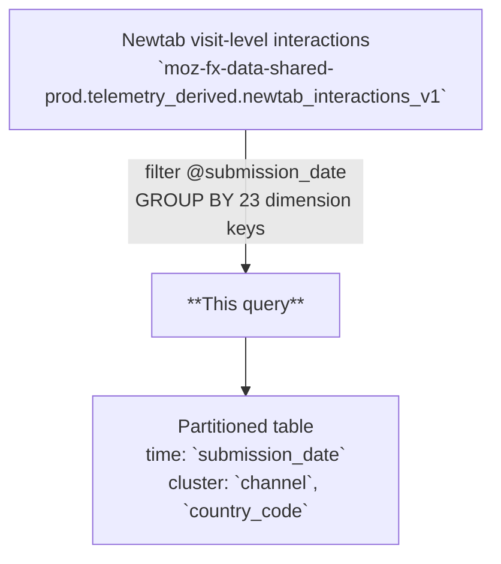

# Newtab Interactions Daily Aggregates

A daily aggregation of newtab user interactions partitioned by `submission_date`, with one row per unique combination of date, geography, browser, search, newtab configuration, and user dimensions. Covers Top Sites clicks/impressions/dismissals, Pocket story impressions/clicks/saves, and search attribution metrics.

---

## 📌 Overview

| | |
|---|---|
| **Grain** | One row per `(submission_date, country_code, channel, browser_version, browser_name, search_engine, search_access_point, default_search_engine, default_private_search_engine, pocket_story_position, newtab_open_source, pocket_is_signed_in, pocket_enabled, pocket_sponsored_stories_enabled, topsites_enabled, newtab_homepage_category, newtab_newtab_category, topsites_rows, is_new_profile, activity_segment, os, os_version, newtab_search_enabled)` |
| **Source** | `moz-fx-data-shared-prod.telemetry_derived.newtab_interactions_v1` |
| **DAG** | `bqetl_newtab` · daily · incremental |
| **Partitioning** | `submission_date` *(partition filter required)* |
| **Clustering** | `channel`, `country_code` |
| **Retention** | No automatic expiration |
| **Owner** | gkatre@mozilla.com |
| **Version** | v1 (initial version) |

**Use cases:** newtab engagement dashboards · Pocket sponsored/organic attribution · Top Sites click-through rate analysis

---

## 🗺️ Data Flow



---

## 🧠 How It Works

1. **Input** — `newtab_interactions_v1` has one row per newtab visit event, with raw interaction counts and configuration state at the time of the visit.
2. **Aggregation** — 23 dimension fields pass through as GROUP BY keys; unique entities use `COUNT(DISTINCT)` for `client_id`, `legacy_telemetry_client_id`, and `newtab_visit_id`; interaction totals use `SUM()`.
3. **Sponsored/organic split** — Top Sites and Pocket metrics are broken out into `sponsored_*` and `organic_*` variants, allowing paid vs. non-paid surface analysis without post-processing.
4. **Search attribution** — search metrics include `tagged_*`, `follow_on_*`, and `tagged_follow_on_*` ad click/impression variants to support full search revenue attribution chains.
5. **Data inclusion** — all records matching `@submission_date` from the source are included; no bot, synthetic-client, or test-population exclusions are applied at this layer.

---

## 🧾 Key Fields

### Dimensions

| Category | Fields |
|---|---|
| Date & Geo | `submission_date`, `country_code` |
| Browser | `channel`, `browser_version`, `browser_name`, `os`, `os_version` |
| Search | `search_engine`, `search_access_point`, `default_search_engine`, `default_private_search_engine` |
| Newtab config | `newtab_open_source`, `newtab_homepage_category`, `newtab_newtab_category`, `newtab_search_enabled` |
| Pocket config | `pocket_is_signed_in`, `pocket_enabled`, `pocket_sponsored_stories_enabled`, `pocket_story_position` |
| Topsites config | `topsites_enabled`, `topsites_rows` |
| User | `is_new_profile`, `activity_segment` |

### Metrics

| Category | Fields |
|---|---|
| Reach | `client_count`, `legacy_telemetry_client_count`, `newtab_interactions_visits` |
| Top Sites | `topsite_{clicks\|impressions\|dismissals}` · `sponsored_topsite_*` · `organic_topsite_*` |
| Search | `searches`, `tagged_search_ad_{clicks\|impressions}`, `follow_on_search_ad_{clicks\|impressions}`, `tagged_follow_on_search_ad_{clicks\|impressions}` |
| Pocket | `pocket_{impressions\|clicks\|saves}` · `sponsored_pocket_*` · `organic_pocket_*` |

---

## 🧩 Example Queries

```sql
-- 1. Daily Top Sites click-through rate over the past 7 days
SELECT
  submission_date,
  SUM(topsite_clicks) AS topsite_clicks,
  SUM(topsite_impressions) AS topsite_impressions,
  SAFE_DIVIDE(SUM(topsite_clicks), SUM(topsite_impressions)) AS topsite_ctr
FROM `moz-fx-data-shared-prod.telemetry_derived.newtab_daily_interactions_aggregates_v1`
WHERE submission_date >= DATE_SUB(CURRENT_DATE(), INTERVAL 7 DAY)
GROUP BY 1
ORDER BY 1 DESC;
```

```sql
-- 2. Pocket sponsored vs. organic click rate by country
SELECT
  submission_date,
  country_code,
  SUM(sponsored_pocket_clicks) AS sponsored_clicks,
  SUM(organic_pocket_clicks) AS organic_clicks,
  SAFE_DIVIDE(SUM(sponsored_pocket_clicks), SUM(sponsored_pocket_impressions)) AS sponsored_ctr
FROM `moz-fx-data-shared-prod.telemetry_derived.newtab_daily_interactions_aggregates_v1`
WHERE submission_date = DATE_SUB(CURRENT_DATE(), INTERVAL 1 DAY)
GROUP BY 1, 2
ORDER BY sponsored_clicks DESC;
```

```sql
-- 3. Search ad click attribution by engine and channel for signed-in Pocket users
SELECT
  submission_date,
  search_engine,
  SUM(tagged_search_ad_clicks) AS tagged_clicks,
  SUM(follow_on_search_ad_clicks) AS follow_on_clicks,
  SAFE_DIVIDE(SUM(tagged_search_ad_clicks), SUM(tagged_search_ad_impressions)) AS tagged_ad_ctr
FROM `moz-fx-data-shared-prod.telemetry_derived.newtab_daily_interactions_aggregates_v1`
WHERE submission_date >= DATE_SUB(CURRENT_DATE(), INTERVAL 7 DAY)
  AND pocket_is_signed_in = TRUE
GROUP BY 1, 2
ORDER BY 1 DESC, tagged_clicks DESC;
```

---

## 🔧 Implementation Notes

- Incremental: filtered by `@submission_date` parameter; one partition is written per daily run.
- No deduplication needed — source `newtab_interactions_v1` is already at visit-event grain; `COUNT(DISTINCT)` handles multi-row clients within a day.
- Feature flag dimensions (`pocket_enabled`, `topsites_enabled`, `newtab_search_enabled`, etc.) are passed through as-is; no coalescing or defaulting is applied.
- `SAFE_DIVIDE` is recommended for all ratio calculations (CTR, save rate) to avoid division-by-zero on dimensions with zero impressions.
- `pocket_story_position` is 0-indexed; position `NULL` indicates non-Pocket visits aggregated in the same bucket.

---

## 📌 Notes & Conventions

- `client_count` = `COUNT(DISTINCT client_id)` — unique Glean clients contributing to this aggregate bucket.
- `legacy_telemetry_client_count` = `COUNT(DISTINCT legacy_telemetry_client_id)` — unique legacy telemetry clients; use for pre-Glean continuity comparisons.
- `newtab_interactions_visits` = `COUNT(DISTINCT newtab_visit_id)` — unique newtab page opens with at least one interaction event.
- `sponsored_*` / `organic_*` = paid (Mozilla Ads / Pocket sponsored) vs. non-paid surface breakdown.
- `tagged_*` = search result pages with Mozilla attribution tag present, enabling ad revenue attribution.
- `follow_on_*` = subsequent searches after an initial tagged search; `tagged_follow_on_*` = follow-on searches that also carry the tag.
- NULL in config fields (`pocket_is_signed_in`, `topsites_enabled`, etc.) indicates the configuration state was not captured for that visit.

---

## 🗃️ Schema & Related Tables

- Full field definitions: [`schema.yaml`](schema.yaml)
- **Upstream**: `moz-fx-data-shared-prod.telemetry_derived.newtab_interactions_v1` — visit-level newtab interaction events, one row per newtab visit with raw interaction counts
- **Downstream**: `mozdata.telemetry.newtab_daily_interactions_aggregates` for user-facing public views; consumed by newtab engagement dashboards and Pocket attribution reporting
