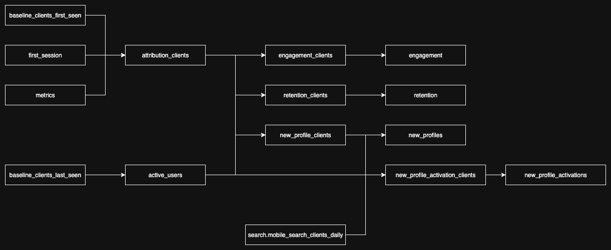

# Mobile Acquisition - Generator

## Purpose

This generator aims to provide reusable logic (templates) for generating mobile acquisition data models consistently across our core mobile products. These models contains metrics used for deriving our core KPI's and are generator for each product specified in `__init__.py`.

### Templates

Templates included in the generator:

- `attribution_clients` - client level first time attribution in one place *(expected grain: client_id + normalized_channel)*

- `active_users` - a view on top of baseline_clients_last_seen with some transformations used downstream (acts as the base for the other models) *(expected grain: submission_date + client_id + normalized_channel)*

- `engagement_clients` - a continuous calculation of client engagement *(expected grain: submission_date + client_id + normalized_channel)*

- `engagement` - aggregated engagement stats *(aggregated dataset)*

- `retention_clients` - a continuous calculation of client retention *(expected grain: submission_date + client_id + normalized_channel)*

- `retention` - aggregated retention stats *(aggregated dataset)*

- `new_profile_activation_clients` - indicates if a new profile has "activated" *(expected grain: client_id + normalized_channel)*

- `new_profile_activations` - aggregates stats of new profile activations *(aggregated dataset)*

- `new_profiles` - agggregates stats around new profiles / clients *(aggregated dataset)*

### Generated product lineage



## Usage

### Folder Structure

```
├── __init__.py  # python logic to render the templates for each specified product
├── README.md
└── templates  # contains all templates
    ├── [template].query.sql      # the logic for pupulating the table with data [*]
    ├── [template].metadata.yaml  # configuration and information about the table [*]
    ├── [template].schema.yaml    # list of field the table contains [*]
    ├── [template].bigconfig.yml  # Bigeye metric definition to be used on this table [*]
    ├── [template].view.sql       # what the view for accessing the table should look like
    └── union.view.sql            # logic for unioning all products together

[*] - these templates are required when query.sql exists for the template
```

### Using the generator

Render the templates for all products using:

```shell
bqetl generate mobile_kpi_support_metrics
```

By default this will save the rendered queries inside `sql/moz-fx-data-shared-prod` directory. To write to a different directory please use `--output_dir` option, example: `bqetl generate mobile_kpi_support_metrics --output_dir=/tmp/sql`