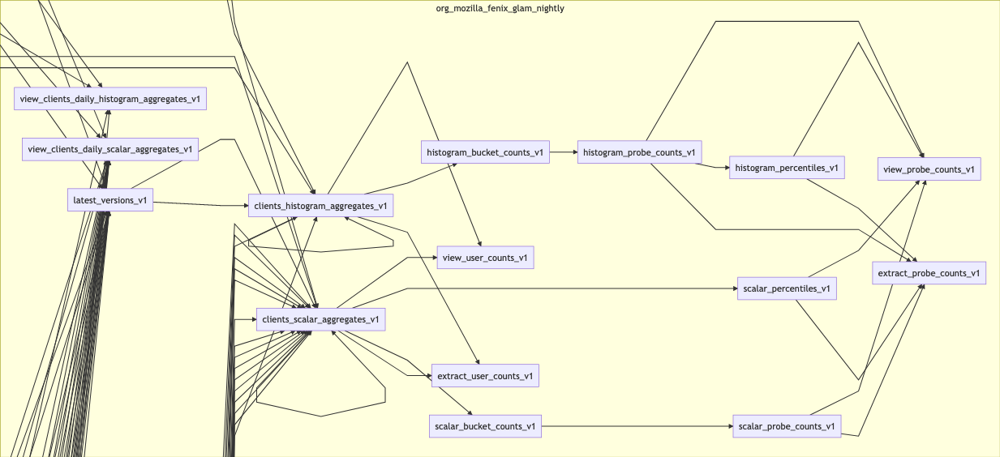
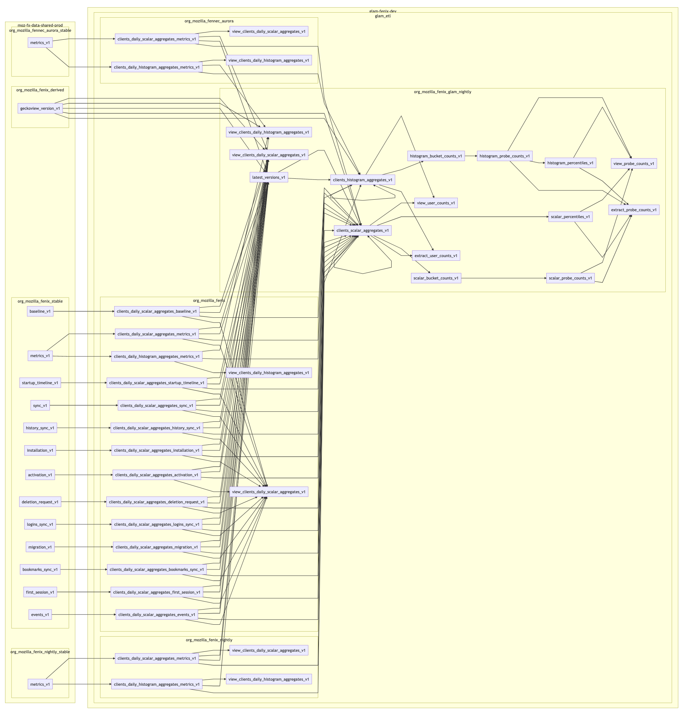

# glam_etl tests

If you find yourself adding or modifying tests in this directory, I hope you
find the following information useful.

## Usage

The schemas for each of the queries were populated using the bootstrap script,
which scraped the depedencies for each of the SQL scripts. It is not expected to
be run again. Instead, iterate on a copy of the corresponding `test_minimal`.

In each `test_minimal`, run the `data.py` to generate the necessary assets for
the test. Run the test using the `-k` flag.

For example:

```bash
cd tests/sql/glam-fenix-dev/glam_etl
python org_mozilla_fenix_glam_nightly__extract_user_counts_v1/test_minimal/data.py
pytest -k extract_user_counts
```

## Test bootstrapping process

This directory contains a bootstrap script used to generate the minimal tests.
These were used to copy the relevant schemas from dependent tables. Re-running
this script is not suggested unless you know what you are doing. Many of the
queries were modified by hand to reduce the number of schemas needed to make
thet tests pass.

`bootstrap deps` creates the `dependencies.json` file using BigQuery dry runs.
`bootstrap skeleton` generates the directory structure for each query in the
GLAM ETL process excluding views. `bootstrap mermaid` generates a document that
can be used to generate the dependency graph using mermaid.js.

```bash
Usage: bootstrap.py [OPTIONS] COMMAND [ARGS]...

  Script for initializing tests for queries related to glam-fenix-dev.

Options:
  --help  Show this message and exit.

Commands:
  deps      Create a dependency file with all links between queries and...
  mermaid   Generate a mermaid diagram of dependencies.
  skeleton  Generate the skeleton for minimal tests.
```

## Queries for the source data

The best way to populate data for the tables is to use the source datasets in
the testing or production tables. Here are a few queries to get started.

```sql
SELECT
  *
FROM
  glam_etl.org_mozilla_fenix_glam_nightly__clients_histogram_aggregates_v1
WHERE
  sample_id=1
  AND ARRAY_LENGTH(histogram_aggregates) > 0
LIMIT 1
```

```sql
SELECT
  *
FROM
  glam_etl.org_mozilla_fenix_glam_nightly__clients_scalar_aggregates_v1
WHERE
  ARRAY_LENGTH(scalar_aggregates) > 0
LIMIT 1
```

```sql
SELECT
  *
FROM
  `glam-fenix-dev.glam_etl.org_mozilla_fenix__clients_daily_scalar_aggregates_metrics_v1`
WHERE
  DATE(_PARTITIONTIME) = "2020-10-01"
LIMIT
  1
```

### Some diagrams

This project is fairly complex. Here's the generated DAG from the dry-runs.

#### Subset of dependencies



#### Full overview of dependencies


